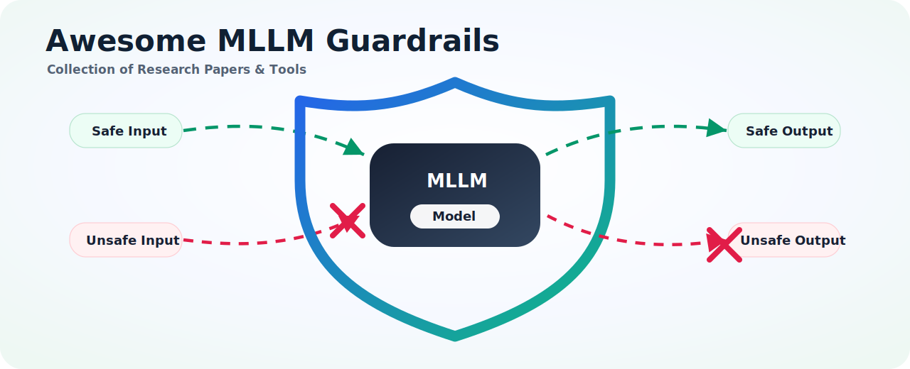

# Awesome MLLM/LLM Guardrails 

**Language:** English | [中文](README.zh-CN.md)

  

A curated map of recent **LLM and MLLM safety guardrail** resources: benchmarks, datasets, guard models, attack methods, evaluation suites, and deployment frameworks. The list is organized by how a practitioner usually works: choose a modality, pick datasets, select guard baselines, test against attacks, and wire the guard into a runtime system.

Contributions are welcome. If you find missing papers, datasets, models, or tools, please open an issue or submit a pull request.

## Contents

- [Benchmarks & Datasets](#benchmarks--datasets)
  - [Text Safety](#text-safety)
  - [Multimodal Safety](#multimodal-safety)
  - [Dialogue Safety](#dialogue-safety)
- [Guard Models and Papers](#guard-models-and-papers)
  - [LLM Guards](#llm-guards)
  - [VLLM/MLLM Guards](#vllmmllm-guards)
- [Attacks](#attacks)
  - [White-box Attacks](#white-box-attacks)
  - [Black-box Attacks](#black-box-attacks)
  - [Red Teaming Tools](#red-teaming-tools)
- [Tools](#tools)
  - [Guardrail Frameworks](#guardrail-frameworks)
  - [Evaluation Platforms](#evaluation-platforms)
- [Open Source Projects](#open-source-projects)

> **Sorting:** Tables with `Venue & Year` are sorted by year in descending order within each category.

---

## 📊 Benchmarks & Datasets

> **Modality Legend:** `[T]` Text | `[I]` Image | `[V]` Video | `[M]` Multi-modal | `[D]` Dialogue

### Text Safety

| Benchmark | Paper | Venue & Year | Modality | Description / Highlights | Links |
| :-------- | :--- | :----------- | :------- | :----------------------- | :---- |
| **SafePyramid** | [SafePyramid: A Hierarchical Benchmark for In-context Policy Guardrailing](https://arxiv.org/abs/2606.29887) | arXiv 2026 | `[T]`,`[D]` | Hierarchical in-context policy guardrailing benchmark with 1K multi-turn conversations, 3K application-specific policies, and 61K+ natural-language rules across three difficulty levels | - |
| **Gate AI Eval Harness** | [Gate AI: LLM Security Benchmark Evaluation Methodology and Results](https://arxiv.org/abs/2606.02959) | arXiv 2026 | `[T]` | Evaluation harness for prompt-injection and jailbreak detectors across 16 public benchmarks with global operating-point selection | - |
| **StreamSafe** | [SentGuard: Sentence-Level Streaming Guardrails for Large Language Models](https://arxiv.org/abs/2606.02041) | arXiv 2026 | `[T]` | Sentence-level streaming safety benchmark with structured annotations across 8 harm categories and risk evolution over reasoning/response segments | - |
| **GuardZoo** | [Triaging Threats to Specialized Guardrails](https://arxiv.org/abs/2605.30693) | arXiv 2026 | `[T]` | Human-annotated guardrail benchmark with 32K+ samples across 15 unsafe categories | - |
| **PII-Bench** | [GLiNER Guard: Unified Encoder Family for Production LLM Safety and Privacy](https://arxiv.org/abs/2605.05277) | arXiv 2026 | `[T]` | Span-level PII benchmark for end-to-end privacy detection in guardrail pipelines | [Dataset](https://huggingface.co/datasets/hivetrace/pii-bench) |
| **ATBench** | [AgentDoG: A Diagnostic Guardrail Framework for AI Agent Safety and Security](https://arxiv.org/abs/2601.18491) | arXiv 2026 | `[T]` | Fine-grained agentic safety benchmark with risk source, failure mode, and consequence taxonomy | [Project](https://ai45lab.github.io/AgentDoG/) |
| **ExpGuardMix** | [ExpGuard: LLM Content Moderation in Specialized Domains](https://arxiv.org/abs/2603.02588) | ICLR 2026 | `[T]` | Domain-specific moderation data for finance, medical, and legal safety | [Dataset](https://huggingface.co/datasets/6rightjade/expguardmix) |
| **Aegis2** | [AEGIS2.0: A Diverse AI Safety Dataset and Risks Taxonomy for Alignment of LLM Guardrails](https://arxiv.org/abs/2501.09004) | NAACL 2025 | `[T]` | Diverse safety data | [Dataset](https://huggingface.co/datasets/nvidia/Aegis-AI-Content-Safety-Dataset-2.0) |
| **Nemotron Safety Guard Dataset v3** | [Llama Nemotron Safety Guard: A Multilingual Input-Output Safety Model and Reasoning Dataset](https://arxiv.org/abs/2508.01710) | arXiv 2025 | `[T]` | Multilingual guard training data, 500K+ samples across 12 languages | [Dataset](https://huggingface.co/datasets/nvidia/Nemotron-Safety-Guard-Dataset-v3) |
| **PolyGuard** | [PolyGuard: Towards Detecting Unsafe Multilingual LLM Prompts](https://openreview.net/forum?id=wbAWKXNeQ4) | COLM 2025 | `[T]` | Multilingual safety | [Dataset](https://huggingface.co/ToxicityPrompts/PolyGuard-Qwen-Smol) |
| **SocialHarmBench** | [SocialHarmBench: Revealing LLM Vulnerabilities to Socially Harmful Requests](https://arxiv.org/abs/2510.04891) | arXiv 2025 | `[T]` | Sociopolitical harms (585 prompts, 34 countries) | [Dataset](https://huggingface.co/datasets/psyonp/SocialHarmBench) |
| **AgentHarm** | [AgentHarm: A Benchmark for Measuring Harmfulness of LLM Agents](https://arxiv.org/abs/2410.09024) | ICLR 2025 | `[T]` | LLM agent harmfulness (260 behaviors) | [Dataset](https://huggingface.co/datasets/AIoT-NLP/AgentHarm) |
| **Pre-Exec Bench** | [Building a Foundational Guardrail for General Agentic Systems via Synthetic Data](https://arxiv.org/abs/2510.09781) | arXiv 2025 | `[T]` | Pre-execution agent safety benchmark for detection, categorization, explanation, and cross-planner generalization | - |
| **HarmBench** | [HarmBench: A Standardized Evaluation Framework for Automated Red Teaming and Robust Refusal](https://arxiv.org/abs/2402.04249) | ICML 2024 | `[T]` | Automated red teaming benchmark | [Dataset](https://huggingface.co/datasets/walledai/HarmBench) |
| **JailbreakBench** | [JailbreakBench: An Open Robustness Benchmark for Jailbreaking Large Language Models](https://arxiv.org/abs/2404.01318) | NeurIPS 2024 | `[T]` | Jailbreak robustness evaluation | [Dataset](https://huggingface.co/datasets/JailbreakBench/JBB-Behaviors) |
| **WildChat** | [WildChat: 1M ChatGPT Interaction Logs in the Wild](https://arxiv.org/abs/2405.01470) | ICLR 2024 | `[T]` | Real-world jailbreak dataset (1M conversations) | [Dataset](https://huggingface.co/datasets/allenai/WildChat-1M) |
| **LMSYS-Chat-1M** | [LMSYS-Chat-1M: A Large-Scale Real-World LLM Conversation Dataset](https://arxiv.org/abs/2309.11998) | ICLR 2024 | `[T]` | Chatbot arena dataset | [Dataset](https://huggingface.co/datasets/lmsys/lmsys-chat-1m) |
| **SafetyBench** | [SafetyBench: Evaluating the Safety of Large Language Models](https://arxiv.org/abs/2309.07045) | ACL 2024 | `[T]` | Comprehensive evaluation (11K prompts) | [Dataset](https://huggingface.co/datasets/OpenSafetyLab/SafetyBench) |
| **XSTest** | [XSTest: A Test Suite for Identifying Exaggerated Safety Behaviours in Large Language Models](https://arxiv.org/abs/2308.01263) | NAACL 2024 | `[T]` | Refusal on safe prompts (200+) | [Dataset](https://huggingface.co/datasets/walledai/XSTest) |
| **SafeRLHF** | [Safe RLHF: Safe Reinforcement Learning from Human Feedback](https://arxiv.org/abs/2310.12773) | ICLR 2024 | `[T]` | Multi-level alignment | [Dataset](https://huggingface.co/datasets/PKU-Alignment/PKU-SafeRLHF) |
| **WildGuardMix** | [WildGuard: Open One-stop Moderation Tools for Safety Risks, Jailbreaks, and Refusals of LLMs](https://arxiv.org/abs/2406.18495) | NeurIPS 2024 | `[T]` | Mixture of safety data | [Dataset](https://huggingface.co/datasets/allenai/WildGuardMix) |
| **StrongREJECT** | [StrongREJECT: A Strong Reject for Empty Jailbreaks](https://arxiv.org/abs/2402.10260) | NeurIPS 2024 | `[T]` | Jailbreak detection (313 prompts) | [Dataset](https://huggingface.co/datasets/darkangel-123/StrongREJECT) |
| **Do-Not-Answer** | [Do-Not-Answer: A Dataset for Evaluating Safeguards in LLMs](https://arxiv.org/abs/2308.13387) | ACL 2024 | `[T]` | Evaluation of refusals | [Dataset](https://huggingface.co/datasets/lmsys/do-not-answer) |
| **Jailjudge** | [JAILJUDGE: A Comprehensive Jailbreak Judge Benchmark with Multi-Agent Enhanced Explanation Evaluation Framework](https://arxiv.org/abs/2410.12855) | arXiv 2024 | `[T]` | Comprehensive jailbreak judge | [Dataset](https://huggingface.co/datasets/jailjudge/JailjudgeBench) |
| **ToxicChat** | [ToxicChat: Unveiling Hidden Challenges of Toxicity Detection in Real-World User-AI Conversation](https://arxiv.org/abs/2310.17389) | EMNLP 2023 | `[T]` | Real-world toxicity detection | [Dataset](https://huggingface.co/datasets/lmsys/toxic-chat) |
| **BeaverTails** | [BeaverTails: Towards Improved Safety Alignment of LLM via a Human-Preference Dataset](https://arxiv.org/abs/2307.04657) | NeurIPS 2023 | `[T]` | Safety pairs (360K pairs) | [Dataset](https://huggingface.co/datasets/PKU-Alignment/BeaverTails) |

### Multimodal Safety

| Benchmark | Paper | Venue & Year | Modality | Description / Highlights | Links |
| :-------- | :--- | :----------- | :------- | :----------------------- | :---- |
| **EgoSafetyBench** | [EgoSafetyBench: A Diagnostic Egocentric Video Benchmark for Evaluating Embodied VLMs as Runtime Safety Guards](https://arxiv.org/abs/2607.00218) | arXiv 2026 | `[V]`,`[M]` | Egocentric video benchmark with 1,200 robot-view scenarios and half-second annotations for streaming embodied VLM safety guards | - |
| **SingGuard-Bench** | [SingGuard: A Policy-Adaptive Multimodal LLM Guardrail with Dynamic Reasoning](https://arxiv.org/abs/2606.22873) | arXiv 2026 | `[M]`,`[D]` | Multimodal guardrail benchmark with 56K+ examples, 80+ fine-grained risk types, dynamic-rule evaluation, and cross-modal joint-risk cases | [Code](https://github.com/inclusionAI/Sing-Guard) |
| **MTMCS-Bench** | [MTMCS-Bench: Evaluating Contextual Safety of Multimodal Large Language Models in Multi-Turn Dialogues](https://arxiv.org/abs/2601.06757) | arXiv 2026 | `[M]`,`[D]` | Multi-turn multimodal contextual safety benchmark with escalation and context-switch risk settings | [Dataset](https://huggingface.co/datasets/ND-25/MCS-bench)  [Code](https://github.com/franciscoliu/MTMCS-Bench) |
| **VLSU** | [VLSU: Mapping the Limits of Joint Multimodal Understanding for AI Safety](https://arxiv.org/abs/2510.18214) | ICLR 2026 | `[M]` | Vision Language Safety Understanding (8K+ pairs) | - |
| **SafeEditBench** | [Towards Policy-Adaptive Image Guardrail: Benchmark and Method](https://arxiv.org/abs/2603.01228) | arXiv 2026 | `[I]`,`[M]` | Cross-policy image guardrail benchmark with policy-aligned safe/unsafe image pairs | [Dataset](https://huggingface.co/datasets/tyodd/SafeEditBench) |
| **SafeVision** | [SafeVision: Efficient Image Guardrail with Robust Policy Adherence and Explainability](https://arxiv.org/abs/2510.23960) | arXiv 2025 | `[M]` | Multimodal safety evaluation | - |
| **SafeWatch** | [SafeWatch: An Efficient Safety-Policy Following Video Guardrail Model with Transparent Explanations](https://arxiv.org/abs/2412.06878) | ICLR 2025 | `[V]` | Video guardrail (2M+ videos) | - |
| **VisionHarm** | [SafeVision: Efficient Image Guardrail with Robust Policy Adherence and Explainability](https://arxiv.org/abs/2510.23960) | arXiv 2025 | `[I]` | Image safety dataset used by SafeVision | - |
| **UnsafeBench** | [UnsafeBench: Benchmarking Image Safety Classifiers on Real-World and AI-Generated Images](https://arxiv.org/abs/2405.03486) | CCS 2025 | `[I]` | Image classifier safety | - |
| **MSTS** | [MSTS: A Multimodal Safety Test Suite for Vision-Language Models](https://arxiv.org/abs/2501.10057) | arXiv 2025 | `[M]` | Multimodal Safety Test Suite | - |
| **MSSBench** | [Multimodal Situational Safety](https://arxiv.org/abs/2410.06172) | ICLR 2025 | `[M]` | Multimodal situational safety | - |
| **Video-SafetyBench** | [Video-SafetyBench: A Benchmark for Safety Evaluation of Video Large Language Models](https://arxiv.org/abs/2505.11842) | NeurIPS 2025 | `[V]` | Video safety benchmark | - |
| **SafeMT** | [SafeMT: Multi-turn Safety for Multimodal Language Models](https://arxiv.org/abs/2510.12133) | arXiv 2025 | `[M]`,`[D]` | Multi-turn multimodal safety | - |
| **BeaverTails-V** | [Safe RLHF-V](https://arxiv.org/abs/2503.17682) | arXiv 2025 | `[I]`,`[T]` | Multimodal safety data across visual/text harm categories | [Dataset](https://huggingface.co/datasets/PKU-Alignment/BeaverTails-V) |
| **MM-SafetyBench** | [MM-SafetyBench: A Benchmark for Safety Evaluation of Multimodal Large Language Models](https://arxiv.org/abs/2311.17600) | ECCV 2024 | `[M]` | Multimodal safety benchmark | - |
| **JailbreakV-28K** | [JailbreakV-28K: A Benchmark for Assessing the Robustness of Multimodal Large Language Models against Jailbreak Attacks](https://arxiv.org/abs/2404.03027) | arXiv 2024 | `[M]` | 28K jailbreak pairs | - |

### Dialogue Safety

| Benchmark | Paper | Venue & Year | Modality | Description / Highlights | Links |
| :-------- | :--- | :----------- | :------- | :----------------------- | :---- |
| **SafeDialBench** | [SafeDialBench: A Fine-Grained Safety Evaluation Benchmark for Large Language Models in Multi-Turn Dialogues with Diverse Jailbreak Attacks](https://arxiv.org/abs/2502.11090) | arXiv 2025 | `[D]` | Multi-turn jailbreak dialogues | - |
| **CoSafe** | [CoSafe: Evaluating Large Language Model Safety in Multi-Turn Dialogue Coreference](https://arxiv.org/abs/2406.17626) | EMNLP 2024 | `[D]` | Multi-turn dialogue safety | - |

---

## 🛡️ Guard Models and Papers

### LLM Guards

| Model | Paper | Venue & Year | Modality | Description / Highlights | Links |
| :---- | :--- | :----------- | :------- | :----------------------- | :---- |
| **DT-Guard** | [DT-Guard: Intent-Driven Reasoning-Active Training for Reasoning-Free LLM Safety Guardrail](https://arxiv.org/abs/2607.06326) | arXiv 2026 | `[T]` | Reasoning-active training and reasoning-free inference guardrail that internalizes intent, category, and safety labels for low-latency moderation | - |
| **HaloGuard 1.0** | [HaloGuard 1.0: An Open Weights Constitutional Classifier for Multilingual AI Safety](https://arxiv.org/abs/2607.02079) | arXiv 2026 | `[T]` | Open-weights constitutional classifier for multilingual prompt safety across 46 policies and 46 languages | [HF](https://huggingface.co/collections/astroware/haloguard-10) |
| **kNNGuard** | [kNNGuard: Turning LLM Hidden Activations into a Training-Free Configurable Guardrail](https://arxiv.org/abs/2607.02072) | arXiv 2026 | `[T]` | Training-free configurable guardrail using hidden activations and small safe/unsafe prompt banks for fast domain adaptation | - |
| **LeanGuard** | [Do Safety Guardrails Need to Reason? LeanGuard: A Fast and Light Approach for Robust Moderation](https://arxiv.org/abs/2606.26686) | arXiv 2026 | `[T]` | Lightweight label-only encoder guardrail that questions CoT necessity and reports ~100x lower inference compute than reasoning guards | [Code](https://github.com/ndb796/LeanGuard) |
| **TRIAD** | [From Risk Classification to Action Plan Remediation: A Guardrail Feedback Driven Framework for LLM Agents](https://arxiv.org/abs/2606.05805) | arXiv 2026 | `[T]` | Guardrail-integrated agent framework that turns safety feedback into plan remediation instead of only allow/block decisions | [Code](https://github.com/YUHAOSUNABC/TRIAD) |
| **IndicGuard** | [IndicGuard: A Multilingual Safety Guard Model and Dataset for Indic Languages](https://arxiv.org/abs/2606.22841) | arXiv 2026 | `[T]` | Multilingual safety guard model and culturally nuanced dataset for ten major Indic languages, localized harm categories, and adversarial jailbreaks | - |
| **Membrane** | [Membrane: A Self-Evolving Contrastive Safety Memory for LLM Agent Defense](https://arxiv.org/abs/2606.05743) | arXiv 2026 | `[T]` | Self-evolving guardrail using Contrastive Safety Memory for adaptive jailbreak and agent-safety defense without retraining | - |
| **GuardNet** | [GuardNet: Ensemble Strategies of Shallow Neural Networks for Robust Prompt Injection and Jailbreak Detection](https://arxiv.org/abs/2606.05566) | arXiv 2026 | `[T]` | Lightweight BiLSTM ensemble guardrail for low-latency prompt-injection and jailbreak detection | - |
| **SentGuard** | [SentGuard: Sentence-Level Streaming Guardrails for Large Language Models](https://arxiv.org/abs/2606.02041) | arXiv 2026 | `[T]` | Parallel sentence-level streaming guardrail that buffers generated text and moderates complete sentence chunks before release | - |
| **BraveGuard** | [BraveGuard: From Open-World Threats to Safer Computer-Use Agents](https://arxiv.org/abs/2606.01166) | arXiv 2026 | `[T]` | Self-evolving trajectory-level guard training from open-world threat signals for computer-use agents | [HF](https://huggingface.co/Yunhao-Feng/BraveGuard) |
| **ConsisGuard** | [ConsisGuard: Aligning Safety Deliberation with Policy Enforcement in LLM Guardrails](https://arxiv.org/abs/2605.31073) | arXiv 2026 | `[T]` | Consistency-aware reasoning guardrail that aligns policy-grounded deliberation with final safety decisions | - |
| **RouteGuard** | [Triaging Threats to Specialized Guardrails](https://arxiv.org/abs/2605.30693) | arXiv 2026 | `[T]` | Router-expert guardrail framework that dispatches conversations to specialized threat-domain experts | - |
| **CoLaGuard** | [Robust and Efficient Guardrails with Latent Reasoning](https://arxiv.org/abs/2605.29068) | arXiv 2026 | `[T]` | Latent-reasoning guardrail that internalizes safety rationales for lower-latency prompt and response moderation | - |
| **GLiNER Guard** | [GLiNER Guard: Unified Encoder Family for Production LLM Safety and Privacy](https://arxiv.org/abs/2605.05277) | arXiv 2026 | `[T]` | Unified encoder family for safety moderation, PII detection, and prompt attack detection in one forward pass | [HF](https://huggingface.co/collections/hivetrace/gliner-guard-v1)  [Dataset](https://huggingface.co/datasets/hivetrace/pii-bench) |
| **GLiGuard** | [GLiGuard: Schema-Conditioned Classification for LLM Safeguard](https://arxiv.org/abs/2605.07982) | arXiv 2026 | `[T]` | Compact schema-conditioned bidirectional encoder for prompt safety, response safety, refusals, harm categories, and jailbreak strategies | [HF](https://huggingface.co/fastino/gliguard-LLMGuardrails-300M)  [Code](https://github.com/fastino-ai/GLiGuard) |
| **FlexGuard** | [FlexGuard: Continuous Risk Scoring for Strictness-Adaptive LLM Content Moderation](https://arxiv.org/abs/2602.23636) | ACL 2026 | `[T]` | Continuous risk scoring | [HF](https://huggingface.co/Tommy-DING/FlexGuard-Qwen3-8B)  [Code](https://github.com/TommyDzh/FlexGuard) |
| **SafeDream** | [SafeDream: Safety World Model for Proactive Early Jailbreak Detection](https://arxiv.org/abs/2604.16824) | arXiv 2026 | `[T]` | Safety alignment via dream methodology | - |
| **MOSAIC** | [MOSAIC: Composable Safety Alignment with Modular Control Tokens](https://arxiv.org/abs/2603.16210) | arXiv 2026 | `[T]` | Multi-dimensional safety analysis | - |
| **YuFeng-XGuard** | [YuFeng-XGuard: A Reasoning-Centric, Interpretable, and Flexible Guardrail Model for Large Language Models](https://arxiv.org/abs/2601.15588) | arXiv 2026 | `[T]` | Tiered inference strategy with dynamic policy adjustments | [HF](https://huggingface.co/Alibaba-AAIG/YuFeng-XGuard-Reason-8B) |
| **GaaA** | [Guardian-as-an-Advisor: Advancing Next-Generation Guardian Models for Trustworthy LLMs](https://arxiv.org/abs/2604.07655) | arXiv 2026 | `[T]` | Soft-gating pipeline where the guardrail acts as an advisor | - |
| **LEG** | [A Lightweight Explainable Guardrail for Prompt Safety](https://arxiv.org/abs/2602.15853) | ACL 2026 | `[T]` | Modular external guardrail providing interpretable explanations | - |
| **BARRED** | [BARRED: Synthetic Training of Custom Policy Guardrails via Asymmetric Debate](https://arxiv.org/abs/2604.25203) | arXiv 2026 | `[T]` | High-fidelity synthetic training data via multi-agent debate | - |
| **SafeHarbor** | [SafeHarbor: Hierarchical Memory-Augmented Guardrail for LLM Agent Safety](https://arxiv.org/abs/2605.05704) | ICML 2026 | `[T]` | Training-free hierarchical memory-augmented guardrail for LLM agents with dynamic rule injection and self-evolving memory structure | [Code](https://github.com/ljj-cyber/SafeHarbor) |
| **ToolSafe / TS-Guard** | [ToolSafe: Enhancing Tool Invocation Safety of LLM-based agents via Proactive Step-level Guardrail and Feedback](https://arxiv.org/abs/2601.10156) | arXiv 2026 | `[T]` | Step-level proactive guardrail for unsafe tool invocation in LLM agents | [Code](https://github.com/MurrayTom/ToolSafe) |
| **SafePred** | [SafePred: A Predictive Guardrail for Computer-Using Agents via World Models](https://arxiv.org/abs/2602.01725) | arXiv 2026 | `[T]` | Predictive guardrail for computer-using agents with short- and long-term risk prediction | [Code](https://github.com/YurunChen/SafePred) |
| **SIREN** | [LLM Safety From Within: Detecting Harmful Content with Internal Representations](https://arxiv.org/abs/2604.18519) | arXiv 2026 | `[T]` | Lightweight harmfulness detector using safety neurons and adaptive layer-weighted internal representations | [HF](https://huggingface.co/UofTCSSLab/SIREN-Llama-3.2-1B)  [Code](https://github.com/CSSLab/SIREN) |
| **AgentDoG** | [AgentDoG: A Diagnostic Guardrail Framework for AI Agent Safety and Security](https://arxiv.org/abs/2601.18491) | arXiv 2026 | `[T]` | Diagnostic guardrail for agent trajectories with fine-grained risk taxonomy and root-cause explanations | [Project](https://ai45lab.github.io/AgentDoG/) |
| **ExpGuard** | [ExpGuard: LLM Content Moderation in Specialized Domains](https://arxiv.org/abs/2603.02588) | ICLR 2026 | `[T]` | Specialized guardrail for harmful prompts and responses in finance, medical, and legal domains | [Code](https://github.com/brightjade/ExpGuard)  [Dataset](https://huggingface.co/datasets/6rightjade/expguardmix)  [Models](https://huggingface.co/collections/6rightjade/expguard) |
| **Llama Guard 4** | - | Meta 2025 | `[M]` | Multimodal safety model for image and text moderation | [HF](https://huggingface.co/meta-llama/Llama-Guard-4-12B) |
| **Prompt Guard 2** | - | Meta 2025 | `[T]` | Malicious prompt injection detection | [HF](https://huggingface.co/meta-llama/Prompt-Guard-2-86M) |
| **Nemotron Safety Guard** | - | NVIDIA 2025 | `[T]` | Multilingual content safety guard trained with Nemotron/Aegis data | [HF](https://huggingface.co/nvidia/Llama-3.1-Nemotron-Safety-Guard-8B-v3) |
| **Qwen3Guard-Gen** | [Qwen3Guard Technical Report](https://arxiv.org/abs/2510.14276) | arXiv 2025 | `[T]` | Generative guard with safety levels, categories, multilingual support | [HF 0.6B](https://huggingface.co/Qwen/Qwen3Guard-Gen-0.6B)  [HF 4B](https://huggingface.co/Qwen/Qwen3Guard-Gen-4B)  [HF 8B](https://huggingface.co/Qwen/Qwen3Guard-Gen-8B)  [Code](https://github.com/QwenLM/Qwen3Guard) |
| **Qwen3Guard-Stream** | [Qwen3Guard Technical Report](https://arxiv.org/abs/2510.14276) | arXiv 2025 | `[T]` | Token-level streaming safety monitoring for incremental generation | [HF 0.6B](https://huggingface.co/Qwen/Qwen3Guard-Stream-0.6B)  [HF 4B](https://huggingface.co/Qwen/Qwen3Guard-Stream-4B)  [HF 8B](https://huggingface.co/Qwen/Qwen3Guard-Stream-8B)  [Code](https://github.com/QwenLM/Qwen3Guard) |
| **Stable Guard** | - | Stability AI 2025 | `[T]` | Stability AI's safety model | [HF](https://huggingface.co/stabilityai/stable-guard-8b) |
| **GuardReasoner** | [GuardReasoner: Towards Reasoning-based LLM Safeguards](https://arxiv.org/abs/2501.18492) | arXiv 2025 | `[T]` | Reasoning-based safeguard framework | [Code](https://github.com/yueliu1999/GuardReasoner) |
| **C-SafeGen** | [C-SafeGen: Certified Safe LLM Generation with Claim-Based Streaming Guardrails](https://openreview.net/forum?id=nOsEyBGk1I) | NeurIPS 2025 | `[T]` | Certified safe generation via claim-based streaming | - |
| **R2-Guard** | [R2-Guard: Robust Reasoning Enabled LLM Guardrail via Knowledge-Enhanced Logical Reasoning](https://arxiv.org/abs/2407.05557) | ICLR 2025 | `[T]` | Robust reasoning guardrail using prob-graphical models | - |
| **Safiron** | [Building a Foundational Guardrail for General Agentic Systems via Synthetic Data](https://arxiv.org/abs/2510.09781) | arXiv 2025 | `[T]` | Foundational pre-execution guardrail for general agentic systems trained with synthetic trajectories | - |
| **AGrail** | [AGrail: A Lifelong Agent Guardrail with Effective and Adaptive Safety Detection](https://arxiv.org/abs/2502.11448) | ACL 2025 | `[T]` | Lifelong agent guardrail with adaptive safety check generation and test-time refinement | [Code](https://github.com/SaFoLab-WISC/AGrail4Agent) |
| **RoboGuard** | [Safety Guardrails for LLM-Enabled Robots](https://arxiv.org/abs/2503.07885) | arXiv 2025 | `[T]` | Two-stage guardrail for robot plans using grounded safety rules and temporal logic synthesis | [Project](https://robo-guard.github.io/) |
| **ShieldAgent** | [ShieldAgent: Shielding Agents via Verifiable Safety Policy Reasoning](https://arxiv.org/abs/2503.22738) | arXiv 2025 | `[T]` | Guardrail agent using verifiable policy reasoning over agent action trajectories | [Project](https://shieldagent-aiguard.github.io/) |
| **Llama Guard 3** | - | Meta Connect 2024 | `[M]` | Multimodal input/output guard | [HF](https://huggingface.co/meta-llama/Llama-Guard-3-8B) |
| **Llama Guard 2** | - | Meta 2024 | `[T]` | Enhanced version | [HF](https://huggingface.co/meta-llama/Llama-Guard-2-8B) |
| **ShieldGemma** | [ShieldGemma: Generative AI Content Moderation Based on Gemma](https://arxiv.org/abs/2407.21772) | arXiv 2024 | `[T]` | Google's safety filter | [HF](https://huggingface.co/google/shieldgemma-9b) |
| **WildGuard** | [WildGuard: Open One-Stop Moderation Tools for Safety Risks, Jailbreaks, and Refusals of LLMs](https://arxiv.org/abs/2406.18495) | NeurIPS 2024 | `[T]` | One-stop moderation tool | [HF](https://huggingface.co/allenai/wildguard)  [Code](https://github.com/allenai/wildguard) |
| **Aegis** | [AEGIS: Online Adaptive AI Content Safety Moderation with Ensemble of LLM Experts](https://arxiv.org/abs/2404.05993) | arXiv 2024 | `[T]` | Online adaptive content safety | [HF](https://huggingface.co/nvidia/Aegis-AI-Content-Safety-Llama-3-8B) |
| **Shield** | - | NVIDIA 2024 | `[T]` | Safety description guided generation | [HF](https://huggingface.co/nvidia/ShieldLM-7B-Instruct)  [Code](https://github.com/NVIDIA/NeMo-Guardrails) |
| **Granite Guardian** | - | IBM 2024 | `[T]` | Specialized open-source safety models | [HF](https://huggingface.co/ibm-granite)  [Code](https://github.com/ibm-granite/granite-guardian) |
| **Llama Guard** | [Llama Guard: Safeguarding Large Language Models](https://ai.meta.com/research/publications/llama-guard-safety-backing-language-models/) | arXiv 2023 | `[T]` | Pioneer guard model | [HF](https://huggingface.co/meta-llama/Llama-Guard-7B)  [Code](https://github.com/facebookresearch/llama-recipes) |
| **WildGuard Lite** | - | - | `[T]` | Lightweight moderation model | [HF](https://huggingface.co/aisu/WildGuard-Lite) |
| **Beaver** | - | PKU | `[T]` | Open source safety alignment | [HF](https://huggingface.co/PKU-Alignment/beaver-7b-v2.0)  [Code](https://github.com/PKU-Alignment/safe-rlhf) |
| **GPT-4 Content Mod.** | - | OpenAI | `[T]` | Built-in content moderation | [API](https://platform.openai.com/docs/guides/moderation) |
| **Claude 3 Haiku** | - | Anthropic | `[T]` | Constitutional AI based safety | [API](https://www.anthropic.com/claude-3-haiku) |
| **Gemini Safety** | - | Google | `[T]` | Built-in safety filters | [API](https://gemini.google.com) |
| **Azure Content Safety** | - | Microsoft | `[T]`,`[I]` | Enterprise content moderation | [API](https://azure.microsoft.com/services/ai-services/content-safety/) |

### VLLM/MLLM Guards

| Model | Paper | Venue & Year | Modality | Description / Highlights | Links |
| :---- | :--- | :----------- | :------- | :----------------------- | :---- |
| **SingGuard** | [SingGuard: A Policy-Adaptive Multimodal LLM Guardrail with Dynamic Reasoning](https://arxiv.org/abs/2606.22873) | arXiv 2026 | `[M]`,`[D]` | Policy-adaptive multimodal guardrail family with runtime policy input, rule-level triggering, and fast/hybrid/slow reasoning regimes | [Code](https://github.com/inclusionAI/Sing-Guard) |
| **GuardReasoner-Omni** | [GuardReasoner-Omni: A Reasoning-based Multi-modal Guardrail for Text, Image, Video, and Audio](https://arxiv.org/abs/2602.03328) | arXiv 2026 | `[M]` | Omni-modal reasoning guardrail for text, image, video, and audio moderation with SFT and RL training | [HF 3B](https://huggingface.co/zhu-thu-22/GuardReasoner-Omni-3B)  [HF 7B](https://huggingface.co/zhu-thu-22/GuardReasoner-Omni-7B) |
| **SafeLens** | [SafeLens: Deliberate and Efficient Video Guardrails with Fast-and-Slow Screening](https://arxiv.org/abs/2605.17610) | arXiv 2026 | `[V]` | Video guardrail framework with fast-and-slow screening, influence-filtered SafeWatch data, and test-time reasoning traces | - |
| **VLSU** | [VLSU: Mapping the Limits of Joint Multimodal Understanding for AI Safety](https://arxiv.org/abs/2510.18214) | ICLR 2026 | `[M]` | Vision Language Safety Understanding (8K+ pairs) | [Code](https://github.com/apple/ml-vlsu) |
| **SafeGuard-VL** | [Towards Policy-Adaptive Image Guardrail: Benchmark and Method](https://arxiv.org/abs/2603.01228) | arXiv 2026 | `[I]`,`[M]` | Policy-aware visual safety guardrail trained with RLVR/GRPO for dynamic safety policies | [HF](https://huggingface.co/tyodd/SafeGuard-VL-RL)  [Dataset](https://huggingface.co/datasets/tyodd/SafeEditBench) |
| **HomeGuard** | [HomeGuard: VLM-based Embodied Safeguard for Identifying Contextual Risk in Household Task](https://arxiv.org/abs/2603.14367) | arXiv 2026 | `[M]` | Embodied VLM safeguard for contextual household risk with grounded visual anchors | [Code](https://github.com/AI45Lab/HomeGuard) |
| **Pragma-VL** | [Pragma-VL: Towards a Pragmatic Arbitration of Safety and Helpfulness in MLLMs](https://arxiv.org/abs/2603.13292) | ICLR 2026 | `[M]` | End-to-end MLLM safety-helpfulness arbitration with risk-aware visual perception | [Code](https://github.com/SII-FLEEECERmw/Pragma-VL)  [Dataset](https://huggingface.co/datasets/SII-fleeeecer/PragmaSafe-Beavertails) |
| **UniMod** | [From Sparse Decisions to Dense Reasoning: A Multi-attribute Trajectory Paradigm for Multimodal Moderation](https://arxiv.org/abs/2602.02536) | arXiv 2026 | `[M]` | Multimodal moderation via dense reasoning trajectories, evidence grounding, risk mapping, and policy decisions | - |
| **SafeVision** | [SafeVision: Efficient Image Guardrail with Robust Policy Adherence and Explainability](https://arxiv.org/abs/2510.23960) | ICLR 2025 | `[M]` | Multimodal safety evaluation | [HF](https://huggingface.co/Virtue-AI-HUB) |
| **SaFeR-VLM** | [SaFeR-VLM: Toward Safety-aware Fine-grained Reasoning in Multimodal Models](https://arxiv.org/abs/2510.06871) | arXiv 2025 | `[M]` | Safety-aware multimodal reasoning framework using safety rollouts, structured rewards, and GRPO | [Code](https://github.com/HarveyYi/SaFeR-VLM) |
| **SafeWatch** | [SafeWatch: An Efficient Safety-Policy Following Video Guardrail Model with Transparent Explanations](https://arxiv.org/abs/2412.06878) | ICLR 2025 | `[V]` | Video guardrail model (2M+ videos) | [HF](https://huggingface.co/Virtue-AI-HUB/SafeWatch-8B)  [Code](https://github.com/BillChan226/SafeWatch) |
| **ShieldGemma 2** | [ShieldGemma 2: Robust and Tractable Image Content Moderation](https://arxiv.org/abs/2504.01081) | arXiv 2025 | `[I]`,`[M]` | Open image moderation model for sexually explicit, violence/gore, and dangerous content | [HF](https://huggingface.co/google/shieldgemma-2-4b-it) |
| **Llama Guard 4** | - | Meta 2025 | `[M]` | Multimodal text/image guard for prompt and response moderation | [HF](https://huggingface.co/meta-llama/Llama-Guard-4-12B) |
| **LlavaGuard** | [LlavaGuard: An Open VLM-based Framework for Safeguarding Vision Datasets and Models](https://proceedings.mlr.press/v267/helff25a.html) | ICML 2025 | `[I]`,`[M]` | VLM safeguard with safety rating, category, and rationale annotations | [Code](https://github.com/ml-research/LlavaGuard) |
| **GuardReasoner-VL** | [GuardReasoner-VL: Safeguarding VLMs via Reinforced Reasoning](https://huggingface.co/papers/2505.11049) | NeurIPS 2025 | `[M]` | Reinforced reasoning-based guard model for VLM safety | [Code](https://github.com/yueliu1999/GuardReasoner-VL) |
| **OMNIGUARD** | [OMNIGUARD: An Efficient Approach for AI Safety Moderation Across Modalities](https://huggingface.co/papers/2505.23856) | EMNLP 2025 | `[M]` | Efficient safety moderation across languages and modalities using internal representations | [Paper](https://aclanthology.org/2025.emnlp-main.819/) |
| **VisionHarm** | [SafeVision: Efficient Image Guardrail with Robust Policy Adherence and Explainability](https://arxiv.org/abs/2510.23960) | ICLR 2025 | `[I]` | Image safety detection | - |
| **LLaVAShield** | [LLaVAShield: Safeguarding Multimodal Multi-Turn Dialogues in Vision-Language Models](https://arxiv.org/abs/2509.25896) | arXiv 2025 | `[M]`,`[D]` | Safeguarding multimodal multi-turn dialogues | [HF](https://huggingface.co/RealSafe/LLaVAShield-v1.0-7B) |
| **UnsafeBench** | [UnsafeBench: Benchmarking Image Safety Classifiers on Real-World and AI-Generated Images](https://arxiv.org/abs/2405.03486) | CCS 2025 | `[I]` | Image classifier safety evaluation | [HF](https://huggingface.co/datasets/yiting/UnsafeBench)  [Code](https://github.com/YitingQu/UnsafeBench) |
| **MSTS** | [MSTS: A Multimodal Safety Test Suite for Vision-Language Models](https://arxiv.org/abs/2501.10057) | arXiv 2025 | `[M]` | Multimodal Safety Test Suite | [HF](https://huggingface.co/datasets/felfri/MSTS)  [Code](https://github.com/paul-rottger/msts-multimodal-safety) |
| **MSSBench** | [Multimodal Situational Safety](https://arxiv.org/abs/2410.06172) | ICLR 2025 | `[M]` | Multimodal situational safety | [Code](https://github.com/eric-ai-lab/MSSBench) |
| **Llama Guard 3 Vision** | [Llama Guard 3 Vision: Safeguarding Human-AI Image Understanding Conversations](https://arxiv.org/abs/2411.10414) | arXiv 2024 | `[M]` | Multimodal input/output guard | [HF](https://huggingface.co/meta-llama/Llama-Guard-3-11B-Vision)  [Code](https://github.com/meta-llama/PurpleLlama) |
| **MM-SafetyBench** | [MM-SafetyBench: A Benchmark for Safety Evaluation of Multimodal Large Language Models](https://arxiv.org/abs/2311.17600) | ECCV 2024 | `[M]` | Multimodal safety benchmark | [HF](https://huggingface.co/datasets/PKU-Alignment/MM-SafetyBench)  [Code](https://github.com/isXinLiu/MM-SafetyBench) |

---

## ⚔️ Attacks

> **White-box**: Requires model weights/gradients | **Black-box**: API-only access

### White-box Attacks

| Attack | Paper | Venue & Year | Modality | Description / Highlights | Links |
| :----- | :--- | :----------- | :------- | :----------------------- | :---- |
| **GCG** | [Universal and Transferable Adversarial Attacks on Aligned Language Models](https://arxiv.org/abs/2307.15043) | ICLR 2024 | `[T]` | Gradient-based suffix optimization | [Code](https://github.com/llm-attacks/llm-attacks) |
| **AutoDAN** | [AutoDAN: Generating Stealthy Jailbreak Prompts on Aligned Large Language Models](https://arxiv.org/abs/2310.04451) | ICLR 2024 | `[T]` | Genetic algorithm for stealthy prompts | [Code](https://github.com/LiYing2010/AutoDAN) |
| **COLD** | [COLD-Attack: Jailbreaking LLMs with Stealthiness and Controllability](https://arxiv.org/abs/2402.08679) | ICML 2024 | `[T]` | Controllable decoding attack | [Code](https://github.com/Yu-Fangxu/COLD-Attack) |
| **AmpleGCG** | [AmpleGCG: Learning a Universal and Transferable Generative Model of Adversarial Suffixes for Jailbreaking Both Open and Closed LLMs](https://arxiv.org/abs/2404.07921) | COLM 2024 | `[T]` | Universal transferable suffixes | [Code](https://github.com/OSU-NLP-Group/AmpleGCG) |
| **AdvPrompter** | [AdvPrompter: Fast Adaptive Adversarial Prompting for LLMs](https://arxiv.org/abs/2404.16873) | ICML 2024 | `[T]` | Adversarial suffix generation | [Code](https://github.com/facebookresearch/advprompter) |
| **MAC** | [Boosting Jailbreak Attack with Momentum](https://arxiv.org/abs/2405.01229) | ICLR Workshop 2024 | `[T]` | Momentum-based attack | [Code](https://github.com/weizeming/momentum-attack-llm) |
| **Harmful Fine-tuning** | [Harmful Fine-tuning Attacks and Defenses for Large Language Models: A Survey](https://arxiv.org/abs/2409.18169) | arXiv 2024 | `[T]` | Harmful Fine-tuning Attacks and Defenses | - |

### Black-box Attacks

| Attack | Paper | Venue & Year | Modality | Description / Highlights | Links |
| :----- | :--- | :----------- | :------- | :----------------------- | :---- |
| **Guardrail Recon** | [Behind the Refusal: Determining Guardrail Activation via Behavioral Monitoring](https://arxiv.org/abs/2607.02121) | arXiv 2026 | `[T]` | Black-box reconnaissance method that distinguishes guardrail blocks from model refusals using HTTP, lexical, and timing signals | - |
| **Guardrail DoS** | [From Shield to Target: Denial-of-Service Attacks on LLM-Based Agent Guardrails](https://arxiv.org/abs/2606.14517) | arXiv 2026 | `[T]` | Availability attack that traps reasoning-based agent guardrails in extended reasoning loops, causing large token and latency amplification | - |
| **Posterior Attack** | [Safety Paradox: How Enhanced Safety Awareness Leaves LLMs Vulnerable to Posterior Attack](https://arxiv.org/abs/2606.05614) | arXiv 2026 | `[T]` | Single-query jailbreak that exploits models' internal safety awareness to bypass guardrails | - |
| **Prompt Overflow** | [Prompt Overflow: What the Guardrail Inspects Is Not What the Model Infers](https://arxiv.org/abs/2605.23196) | arXiv 2026 | `[T]` | Long-context attack that exploits mismatch between guardrail inspection windows and downstream LLM inference windows | - |
| **JRS-Rem** | [Understanding and Defending VLM Jailbreaks via Jailbreak-Related Representation Shift](https://arxiv.org/abs/2603.17372) | arXiv 2026 | `[M]` | Explores representation shift in VLM jailbreaks & defense | - |
| **ALERT** | [ALERT: Zero-shot LLM Jailbreak Detection via Internal Discrepancy Amplification](https://arxiv.org/abs/2601.03600) | arXiv 2026 | `[T]` | Zero-shot detection via internal feature discrepancies | - |
| **Echo Chamber** | [The Echo Chamber Multi-Turn LLM Jailbreak](https://arxiv.org/abs/2601.05742) | arXiv 2026 | `[T]`,`[D]` | Multi-turn gradual escalation attack | - |
| **AMIS** | [Align to Misalign: Automatic LLM Jailbreak with Meta-Optimized LLM Judges](https://arxiv.org/abs/2511.01375) | ICLR 2026 | `[T]` | Meta-optimization evolving prompts and scoring | - |
| **Odysseus** | [Odysseus: Jailbreaking Commercial Multimodal LLM-integrated Systems via Dual Steganography](https://arxiv.org/abs/2512.20168) | NDSS 2026 | `[M]` | Hides malicious intent via dual steganography in images/audio | - |
| **PAIR** | [Jailbreaking Black Box Large Language Models in Twenty Queries](https://arxiv.org/abs/2310.08419) | SaTML 2025 | `[T]` | Iterative LLM-based refinement | [Code](https://github.com/patrickrchao/JailbreakBench) |
| **FigStep** | [FigStep: Jailbreaking Large Vision-Language Models via Typographic Visual Prompts](https://arxiv.org/abs/2311.05608) | AAAI 2025 | `[M]` | VLM multimodal jailbreak | - |
| **Crescendo** | [Great, Now Write an Article About That: The Crescendo Multi-Turn LLM Jailbreak Attack](https://arxiv.org/abs/2404.01833) | USENIX 2025 | `[T]`,`[D]` | Multi-turn escalating attack | - |
| **X-Teaming** | [X-Teaming: Multi-Turn Jailbreaks and Defenses with Adaptive Multi-Agents](https://arxiv.org/abs/2504.13203) | COLM 2025 | `[T]`,`[D]` | Multi-agent coordination | - |
| **FlipAttack** | [FlipAttack: Jailbreak LLMs via Flipping](https://arxiv.org/abs/2410.02832) | ICML 2025 | `[T]` | Left-side noise attack | [Code](https://github.com/yueliu1999/FlipAttack) |
| **E2AT / ProEAT** | [E$^2$AT: Multimodal Jailbreak Defense via Dynamic Joint Optimization for Multimodal Large Language Models](https://arxiv.org/abs/2503.04833) | arXiv 2025 | `[M]` | Adversarial training paradigm tailored for MLLMs | - |
| **LogiBreak** | [Logic Jailbreak: Efficiently Unlocking LLM Safety Restrictions Through Formal Logical Expression](https://arxiv.org/abs/2505.13527) | arXiv 2025 | `[T]` | Converts prompts to formal logical expressions | - |
| **DeepInception** | [DeepInception: Hypnotize Large Language Model to Be Jailbreaker](https://arxiv.org/abs/2311.03191) | NeurIPS 2024 | `[T]` | Multi-layer role-play | [Code](https://github.com/tmlr-group/DeepInception) |
| **TAP** | [Tree of Attacks: Jailbreaking Black-Box LLMs Automatically](https://arxiv.org/abs/2312.02119) | NeurIPS 2024 | `[T]` | Tree-of-thought attack | [Code](https://github.com/RICommunity/TAP) |
| **ArtPrompt** | [ArtPrompt: ASCII Art-based Jailbreak Attacks against Aligned LLMs](https://arxiv.org/abs/2402.11753) | ACL 2024 | `[T]` | ASCII art obfuscation | [Code](https://github.com/uw-nsl/ArtPrompt) |
| **SelfCipher** | [GPT-4 Is Too Smart To Be Safe: Stealthy Chat with LLMs via Cipher](https://arxiv.org/abs/2308.06463) | ICLR 2024 | `[T]` | Cipher encoding | [Code](https://github.com/RobustNLP/CipherChat) |
| **ReNeLLM** | [A Wolf in Sheep's Clothing: Generalized Nested Jailbreak Prompts can Fool Large Language Models Easily](https://arxiv.org/abs/2311.08268) | ACL 2024 | `[T]` | Disguise & reconstruction | [Code](https://github.com/NJUNLP/ReNeLLM) |
| **Many-shot** | [Many-shot Jailbreaking](https://www.anthropic.com/research/many-shot-jailbreaking) | Anthropic 2024 | `[T]` | Long-context few-to-many-shot jailbreaking | - |
| **FuzzLLM** | [FuzzLLM: A Novel and Universal Fuzzing Framework for Proactively Discovering Jailbreak Vulnerabilities in Large Language Models](https://arxiv.org/abs/2309.05274) | ICASSP 2024 | `[T]` | Fuzzing-based discovery | [Code](https://github.com/RainJamesY/FuzzLLM) |
| **MasterKey** | [MasterKey: Automated Jailbreak Across Multiple Large Language Model Chatbots](https://arxiv.org/abs/2307.08715) | NDSS 2024 | `[T]` | Chatbot auto-jailbreak | - |
| **CodeChameleon** | [CodeChameleon: Personalized Encryption Framework for Jailbreaking Large Language Models](https://arxiv.org/abs/2402.16717) | ACL 2024 | `[T]` | Personalized encryption | [Code](https://github.com/huizhang-L/CodeChameleon) |
| **SOP** | [SeqAR: Jailbreak LLMs with Sequential Auto-Generated Characters](https://arxiv.org/abs/2407.01902) | NeurIPS W 2024 | `[T]` | Social facilitation attack | [Code](https://github.com/Yang-Yan-Yang-Yan/SoP) |

### Red Teaming Tools

| Tool | Paper | Links | Description |
| :--- | :--- | :---- | :---------- |
| **Garak** | - | [Code](https://github.com/NVIDIA/garak) | LLM vulnerability scanner |
| **JailbreakBench** | - | [Code](https://github.com/patrickrchao/JailbreakBench) | Robustness benchmark |
| **MMRT** | - | - | Multimodal multi-turn red teaming |
| **Inspectus** | - | - | Security evaluation |
| **Aporia** | - | - | LLM monitoring and safety |

---

## 🧰 Tools

### Guardrail Frameworks

| Tool | Paper | Links | Stars | Description |
| :--- | :--- | :---- | :---- | :---------- |
| **Armorer Guard** | - | [Code](https://github.com/ArmorerLabs/Armorer-Guard) | ⭐40+ | Local Rust scanner and MCP proxy for AI-agent prompt injection, credential leaks, exfiltration, and risky tool calls |
| **NeMo Guardrails** | - | [Code](https://github.com/NVIDIA/NeMo-Guardrails) | ⭐6K+ | NVIDIA's programmable guardrails |
| **LLM-Guard** | - | [Code](https://github.com/laiyer-ai/LLM-Guard) | ⭐2.8K+ | Content filtering library |
| **Guardrails** | - | [Code](https://github.com/guardrails-ai/guardrails) | ⭐6.7K+ | Policy enforcement |
| **Promptfoo** | - | [Code](https://github.com/promptfoo/promptfoo) | ⭐20K+ | LLM testing and safety evaluation |

### Evaluation Platforms

| Tool | Paper | Description |
| :--- | :--- | :---------- |
| **LM Eval Harness** | - | Standardized evaluation |
| **Confident AI** | - | LLM evaluation platform |
| **Giskard** | - | Testing for ML models |
| **Helicone** | - | LLM observability |
| **Guardrails Hub** | - | Pre-built guardrail policies |

---

## 🚀 Open Source Projects

| Project | Paper | Description | Links | Stars |
| :------ | :--- | :---------- | :---- | :---- |
| **ArmorerLabs/Armorer-Guard** | - | Local Rust scanner and MCP proxy for AI-agent security | [GitHub](https://github.com/ArmorerLabs/Armorer-Guard) | ⭐40+ |
| **enguard-ai/awesome-ai-guardrails** | - | Curated AI guardrails resources | [GitHub](https://github.com/enguard-ai/awesome-ai-guardrails) | ⭐50+ |
| **beyefendi/awesome-llm-security** | - | LLM security resources | [GitHub](https://github.com/beyefendi/awesome-llm-security) | ⭐10+ |
| **yueliu1999/Awesome-Jailbreak-on-LLMs** | - | Jailbreak resources | [GitHub](https://github.com/yueliu1999/Awesome-Jailbreak-on-LLMs) | ⭐1.3K+ |
| **CryptoAILab/Awesome-LM-SSP** | - | Safety security privacy | [GitHub](https://github.com/CryptoAILab/Awesome-LM-SSP) | ⭐1.9K+ |
| **NVIDIA/NeMo-Guardrails** | - | Programmable guardrails | [GitHub](https://github.com/NVIDIA/NeMo-Guardrails) | ⭐6K+ |
| **laiyer-ai/LLM-Guard** | - | Content filtering | [GitHub](https://github.com/laiyer-ai/LLM-Guard) | ⭐2.8K+ |
| **guardrails-ai/guardrails** | - | Policy enforcement | [GitHub](https://github.com/guardrails-ai/guardrails) | ⭐6.7K+ |
| **promptfoo/promptfoo** | - | LLM testing | [GitHub](https://github.com/promptfoo/promptfoo) | ⭐20K+ |
| **NVIDIA/garak** | - | LLM vulnerability scanner | [GitHub](https://github.com/NVIDIA/garak) | ⭐7.6K+ |
| **allenai/wildguard** | - | Safety moderation | [GitHub](https://github.com/allenai/wildguard) | ⭐100+ |
| **PKU-Alignment/safe-rlhf** | - | Safety alignment | [GitHub](https://github.com/PKU-Alignment/safe-rlhf) | ⭐1.6K+ |

---
---
### ✉️ Contact Us
For questions or collaborations, please contact:

- Zongyi Li: lizongyi.lzy@antgroup.com
- Yichen Bai: baiyichen.byc@antgroup.com
- Liangbo He: liangbo.hlb@antgroup.com
- Jun Lan: yelan.lj@antgroup.com
