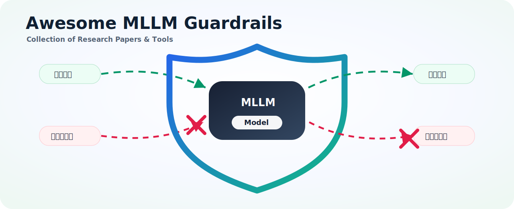

# Awesome MLLM/LLM Guardrails 

**Language:** [English](README.md) | 中文

  

Awesome MLLM/LLM Guardrails 是一个面向大语言模型与多模态大模型安全护栏的开源资源合集，系统整理相关论文、数据集、评测基准、护栏模型、攻击方法、红队工具和部署框架，帮助研究者和工程实践者快速了解 Guardrails 领域进展，并选择合适的模型、数据和评测方案。

欢迎贡献。如果你发现缺失的论文、数据集、模型或工具，请提交 issue 或 pull request。

## 目录

- [Benchmarks & Datasets（基准与数据集）](#benchmarks--datasets)
  - [Text Safety（文本安全）](#text-safety)
  - [Multimodal Safety（多模态安全）](#multimodal-safety)
  - [Dialogue Safety（对话安全）](#dialogue-safety)
- [Guard Models and Papers（护栏模型与论文）](#guard-models-and-papers)
  - [LLM Guards](#llm-guards)
  - [VLLM/MLLM Guards](#vllmmllm-guards)
- [Attacks（攻击）](#attacks)
  - [White-box Attacks（白盒攻击）](#white-box-attacks)
  - [Black-box Attacks（黑盒攻击）](#black-box-attacks)
  - [Red Teaming Tools（红队工具）](#red-teaming-tools)
- [Tools（工具）](#tools)
  - [Guardrail Frameworks（护栏框架）](#guardrail-frameworks)
  - [Evaluation Platforms（评测平台）](#evaluation-platforms)
- [Open Source Projects（开源项目）](#open-source-projects)

> **排序规则：** 带有 `Venue & Year` 的表格在每个类别内按年份倒序排列。

---

## 📊 Benchmarks & Datasets（基准与数据集）

> **模态标记：** `[T]` 文本 | `[I]` 图像 | `[V]` 视频 | `[M]` 多模态 | `[D]` 对话

### Text Safety（文本安全）

| Benchmark | Paper | Venue & Year | Modality | Description / Highlights | Links |
| :-------- | :--- | :----------- | :------- | :----------------------- | :---- |
| **Gate AI Eval Harness** | [Gate AI: LLM Security Benchmark Evaluation Methodology and Results](https://arxiv.org/abs/2606.02959) | arXiv 2026 | `[T]` | 面向 prompt injection 与 jailbreak 检测器的评测方法，覆盖 16 个公开基准并使用全局操作点 | - |
| **GuardZoo** | [Triaging Threats to Specialized Guardrails](https://arxiv.org/abs/2605.30693) | arXiv 2026 | `[T]` | 人工标注护栏基准，包含 32K+ 样本与 15 类不安全风险 | - |
| **PII-Bench** | [GLiNER Guard: Unified Encoder Family for Production LLM Safety and Privacy](https://arxiv.org/abs/2605.05277) | arXiv 2026 | `[T]` | 面向护栏流水线端到端隐私检测的 span-level PII 基准 | [Dataset](https://huggingface.co/datasets/hivetrace/pii-bench) |
| **ATBench** | [AgentDoG: A Diagnostic Guardrail Framework for AI Agent Safety and Security](https://arxiv.org/abs/2601.18491) | arXiv 2026 | `[T]` | 细粒度 Agent 安全基准，覆盖风险来源、失败模式和后果分类 | [Project](https://ai45lab.github.io/AgentDoG/) |
| **ExpGuardMix** | [ExpGuard: LLM Content Moderation in Specialized Domains](https://arxiv.org/abs/2603.02588) | ICLR 2026 | `[T]` | 面向金融、医疗、法律场景的领域专用内容审核数据 | [Dataset](https://huggingface.co/datasets/6rightjade/expguardmix) |
| **Aegis2** | [AEGIS2.0: A Diverse AI Safety Dataset and Risks Taxonomy for Alignment of LLM Guardrails](https://arxiv.org/abs/2501.09004) | NAACL 2025 | `[T]` | 面向护栏对齐的多样化安全数据与风险分类 | [Dataset](https://huggingface.co/datasets/nvidia/Aegis-AI-Content-Safety-Dataset-2.0) |
| **Nemotron Safety Guard Dataset v3** | [Llama Nemotron Safety Guard: A Multilingual Input-Output Safety Model and Reasoning Dataset](https://arxiv.org/abs/2508.01710) | arXiv 2025 | `[T]` | 多语言护栏训练数据，12 种语言，50 万以上样本 | [Dataset](https://huggingface.co/datasets/nvidia/Nemotron-Safety-Guard-Dataset-v3) |
| **PolyGuard** | [PolyGuard: Towards Detecting Unsafe Multilingual LLM Prompts](https://openreview.net/forum?id=wbAWKXNeQ4) | COLM 2025 | `[T]` | 多语言不安全提示检测 | [Dataset](https://huggingface.co/ToxicityPrompts/PolyGuard-Qwen-Smol) |
| **SocialHarmBench** | [SocialHarmBench: Revealing LLM Vulnerabilities to Socially Harmful Requests](https://arxiv.org/abs/2510.04891) | arXiv 2025 | `[T]` | 社会政治伤害场景，585 prompts，覆盖 34 个国家 | [Dataset](https://huggingface.co/datasets/psyonp/SocialHarmBench) |
| **AgentHarm** | [AgentHarm: A Benchmark for Measuring Harmfulness of LLM Agents](https://arxiv.org/abs/2410.09024) | ICLR 2025 | `[T]` | LLM Agent 有害性评测，260 个行为 | [Dataset](https://huggingface.co/datasets/AIoT-NLP/AgentHarm) |
| **Pre-Exec Bench** | [Building a Foundational Guardrail for General Agentic Systems via Synthetic Data](https://arxiv.org/abs/2510.09781) | arXiv 2025 | `[T]` | 面向检测、分类、解释和跨 planner 泛化的 Agent 预执行安全基准 | - |
| **HarmBench** | [HarmBench: A Standardized Evaluation Framework for Automated Red Teaming and Robust Refusal](https://arxiv.org/abs/2402.04249) | ICML 2024 | `[T]` | 自动化红队评测基准 | [Dataset](https://huggingface.co/datasets/walledai/HarmBench) |
| **JailbreakBench** | [JailbreakBench: An Open Robustness Benchmark for Jailbreaking Large Language Models](https://arxiv.org/abs/2404.01318) | NeurIPS 2024 | `[T]` | 越狱鲁棒性评测 | [Dataset](https://huggingface.co/datasets/JailbreakBench/JBB-Behaviors) |
| **WildChat** | [WildChat: 1M ChatGPT Interaction Logs in the Wild](https://arxiv.org/abs/2405.01470) | ICLR 2024 | `[T]` | 真实世界 ChatGPT 交互日志，包含 100 万对话 | [Dataset](https://huggingface.co/datasets/allenai/WildChat-1M) |
| **LMSYS-Chat-1M** | [LMSYS-Chat-1M: A Large-Scale Real-World LLM Conversation Dataset](https://arxiv.org/abs/2309.11998) | ICLR 2024 | `[T]` | Chatbot Arena 真实对话数据集 | [Dataset](https://huggingface.co/datasets/lmsys/lmsys-chat-1m) |
| **SafetyBench** | [SafetyBench: Evaluating the Safety of Large Language Models](https://arxiv.org/abs/2309.07045) | ACL 2024 | `[T]` | 大规模安全能力评测，约 11K prompts | [Dataset](https://huggingface.co/datasets/OpenSafetyLab/SafetyBench) |
| **XSTest** | [XSTest: A Test Suite for Identifying Exaggerated Safety Behaviours in Large Language Models](https://arxiv.org/abs/2308.01263) | NAACL 2024 | `[T]` | 识别模型对安全提示的过度拒答 | [Dataset](https://huggingface.co/datasets/walledai/XSTest) |
| **SafeRLHF** | [Safe RLHF: Safe Reinforcement Learning from Human Feedback](https://arxiv.org/abs/2310.12773) | ICLR 2024 | `[T]` | 多层级安全对齐 | [Dataset](https://huggingface.co/datasets/PKU-Alignment/PKU-SafeRLHF) |
| **WildGuardMix** | [WildGuard: Open One-stop Moderation Tools for Safety Risks, Jailbreaks, and Refusals of LLMs](https://arxiv.org/abs/2406.18495) | NeurIPS 2024 | `[T]` | 混合安全数据，覆盖风险、越狱与拒答 | [Dataset](https://huggingface.co/datasets/allenai/WildGuardMix) |
| **StrongREJECT** | [StrongREJECT: A Strong Reject for Empty Jailbreaks](https://arxiv.org/abs/2402.10260) | NeurIPS 2024 | `[T]` | 越狱评测与拒答强度检测，313 prompts | [Dataset](https://huggingface.co/datasets/darkangel-123/StrongREJECT) |
| **Do-Not-Answer** | [Do-Not-Answer: A Dataset for Evaluating Safeguards in LLMs](https://arxiv.org/abs/2308.13387) | ACL 2024 | `[T]` | 评估模型是否应拒答的安全数据集 | [Dataset](https://huggingface.co/datasets/lmsys/do-not-answer) |
| **Jailjudge** | [JAILJUDGE: A Comprehensive Jailbreak Judge Benchmark with Multi-Agent Enhanced Explanation Evaluation Framework](https://arxiv.org/abs/2410.12855) | arXiv 2024 | `[T]` | 综合越狱裁判基准与多智能体解释评估框架 | [Dataset](https://huggingface.co/datasets/jailjudge/JailjudgeBench) |
| **ToxicChat** | [ToxicChat: Unveiling Hidden Challenges of Toxicity Detection in Real-World User-AI Conversation](https://arxiv.org/abs/2310.17389) | EMNLP 2023 | `[T]` | 真实世界用户-AI 对话毒性检测 | [Dataset](https://huggingface.co/datasets/lmsys/toxic-chat) |
| **BeaverTails** | [BeaverTails: Towards Improved Safety Alignment of LLM via a Human-Preference Dataset](https://arxiv.org/abs/2307.04657) | NeurIPS 2023 | `[T]` | 面向安全偏好学习的数据集，约 36 万偏好对 | [Dataset](https://huggingface.co/datasets/PKU-Alignment/BeaverTails) |

### Multimodal Safety（多模态安全）

| Benchmark | Paper | Venue & Year | Modality | Description / Highlights | Links |
| :-------- | :--- | :----------- | :------- | :----------------------- | :---- |
| **MTMCS-Bench** | [MTMCS-Bench: Evaluating Contextual Safety of Multimodal Large Language Models in Multi-Turn Dialogues](https://arxiv.org/abs/2601.06757) | arXiv 2026 | `[M]`,`[D]` | 多轮多模态上下文安全基准，覆盖渐进升级风险和上下文切换风险 | [Dataset](https://huggingface.co/datasets/ND-25/MCS-bench)  [Code](https://github.com/franciscoliu/MTMCS-Bench) |
| **VLSU** | [VLSU: Mapping the Limits of Joint Multimodal Understanding for AI Safety](https://arxiv.org/abs/2510.18214) | ICLR 2026 | `[M]` | 视觉语言安全理解，8K+ 图文样本 | - |
| **SafeEditBench** | [Towards Policy-Adaptive Image Guardrail: Benchmark and Method](https://arxiv.org/abs/2603.01228) | arXiv 2026 | `[I]`,`[M]` | 跨策略图像护栏基准，包含策略对齐的安全/不安全图像对 | [Dataset](https://huggingface.co/datasets/tyodd/SafeEditBench) |
| **SafeVision** | [SafeVision: Efficient Image Guardrail with Robust Policy Adherence and Explainability](https://arxiv.org/abs/2510.23960) | arXiv 2025 | `[M]` | 多模态安全评测 | - |
| **SafeWatch** | [SafeWatch: An Efficient Safety-Policy Following Video Guardrail Model with Transparent Explanations](https://arxiv.org/abs/2412.06878) | ICLR 2025 | `[V]` | 视频护栏与透明解释，2M+ 视频 | - |
| **VisionHarm** | [SafeVision: Efficient Image Guardrail with Robust Policy Adherence and Explainability](https://arxiv.org/abs/2510.23960) | arXiv 2025 | `[I]` | SafeVision 使用的图像安全数据集 | - |
| **UnsafeBench** | [UnsafeBench: Benchmarking Image Safety Classifiers on Real-World and AI-Generated Images](https://arxiv.org/abs/2405.03486) | CCS 2025 | `[I]` | 真实与生成图像安全分类器基准 | - |
| **MSTS** | [MSTS: A Multimodal Safety Test Suite for Vision-Language Models](https://arxiv.org/abs/2501.10057) | arXiv 2025 | `[M]` | 视觉语言模型多模态安全测试套件 | - |
| **MSSBench** | [Multimodal Situational Safety](https://arxiv.org/abs/2410.06172) | ICLR 2025 | `[M]` | 多模态情境安全评测 | - |
| **Video-SafetyBench** | [Video-SafetyBench: A Benchmark for Safety Evaluation of Video Large Language Models](https://arxiv.org/abs/2505.11842) | NeurIPS 2025 | `[V]` | 视频大模型安全评测基准 | - |
| **SafeMT** | [SafeMT: Multi-turn Safety for Multimodal Language Models](https://arxiv.org/abs/2510.12133) | arXiv 2025 | `[M]`,`[D]` | 多轮多模态安全评测 | - |
| **BeaverTails-V** | [Safe RLHF-V](https://arxiv.org/abs/2503.17682) | arXiv 2025 | `[I]`,`[T]` | 跨视觉/文本风险类别的多模态安全数据 | [Dataset](https://huggingface.co/datasets/PKU-Alignment/BeaverTails-V) |
| **MM-SafetyBench** | [MM-SafetyBench: A Benchmark for Safety Evaluation of Multimodal Large Language Models](https://arxiv.org/abs/2311.17600) | ECCV 2024 | `[M]` | 多模态大模型安全评测基准 | - |
| **JailbreakV-28K** | [JailbreakV-28K: A Benchmark for Assessing the Robustness of Multimodal Large Language Models against Jailbreak Attacks](https://arxiv.org/abs/2404.03027) | arXiv 2024 | `[M]` | 28K 多模态越狱样本对 | - |

### Dialogue Safety（对话安全）

| Benchmark | Paper | Venue & Year | Modality | Description / Highlights | Links |
| :-------- | :--- | :----------- | :------- | :----------------------- | :---- |
| **SafeDialBench** | [SafeDialBench: A Fine-Grained Safety Evaluation Benchmark for Large Language Models in Multi-Turn Dialogues with Diverse Jailbreak Attacks](https://arxiv.org/abs/2502.11090) | arXiv 2025 | `[D]` | 多轮对话中的细粒度安全评测与多样越狱攻击 | - |
| **CoSafe** | [CoSafe: Evaluating Large Language Model Safety in Multi-Turn Dialogue Coreference](https://arxiv.org/abs/2406.17626) | EMNLP 2024 | `[D]` | 多轮对话共指场景安全评测 | - |

---

## 🛡️ Guard Models and Papers（护栏模型与论文）

### LLM Guards（文本护栏）

| Model | Paper | Venue & Year | Modality | Description / Highlights | Links |
| :---- | :--- | :----------- | :------- | :----------------------- | :---- |
| **TRIAD** | [From Risk Classification to Action Plan Remediation: A Guardrail Feedback Driven Framework for LLM Agents](https://arxiv.org/abs/2606.05805) | arXiv 2026 | `[T]` | 护栏集成式 Agent 框架，将安全反馈转化为 plan remediation，而不只是 allow/block 决策 | [Code](https://github.com/YUHAOSUNABC/TRIAD) |
| **Membrane** | [Membrane: A Self-Evolving Contrastive Safety Memory for LLM Agent Defense](https://arxiv.org/abs/2606.05743) | arXiv 2026 | `[T]` | 基于 Contrastive Safety Memory 的自演进护栏，无需重训练即可适应越狱与 Agent 安全风险 | - |
| **GuardNet** | [GuardNet: Ensemble Strategies of Shallow Neural Networks for Robust Prompt Injection and Jailbreak Detection](https://arxiv.org/abs/2606.05566) | arXiv 2026 | `[T]` | 轻量 BiLSTM ensemble 护栏，用于低延迟 prompt injection 与 jailbreak 检测 | - |
| **BraveGuard** | [BraveGuard: From Open-World Threats to Safer Computer-Use Agents](https://arxiv.org/abs/2606.01166) | arXiv 2026 | `[T]` | 从开放世界威胁信号和真实执行轨迹训练的 computer-use agent 轨迹级自演进护栏 | [HF](https://huggingface.co/Yunhao-Feng/BraveGuard) |
| **ConsisGuard** | [ConsisGuard: Aligning Safety Deliberation with Policy Enforcement in LLM Guardrails](https://arxiv.org/abs/2605.31073) | arXiv 2026 | `[T]` | 一致性感知推理护栏，对齐基于策略的安全推理与最终决策执行 | - |
| **RouteGuard** | [Triaging Threats to Specialized Guardrails](https://arxiv.org/abs/2605.30693) | arXiv 2026 | `[T]` | router-expert 护栏框架，将对话分派给特定威胁领域的专家护栏 | - |
| **CoLaGuard** | [Robust and Efficient Guardrails with Latent Reasoning](https://arxiv.org/abs/2605.29068) | arXiv 2026 | `[T]` | 将安全 rationale 内化到 latent reasoning 中，降低 prompt/response 审核延迟 | - |
| **GLiNER Guard** | [GLiNER Guard: Unified Encoder Family for Production LLM Safety and Privacy](https://arxiv.org/abs/2605.05277) | arXiv 2026 | `[T]` | 统一 encoder 家族，在一次前向计算中完成安全审核、PII 检测和 prompt attack 检测 | [HF](https://huggingface.co/collections/hivetrace/gliner-guard-v1)  [Dataset](https://huggingface.co/datasets/hivetrace/pii-bench) |
| **GLiGuard** | [GLiGuard: Schema-Conditioned Classification for LLM Safeguard](https://arxiv.org/abs/2605.07982) | arXiv 2026 | `[T]` | 紧凑的 schema-conditioned 双向 encoder，支持 prompt/response 安全、拒答、细粒度风险类别和越狱策略检测 | [HF](https://huggingface.co/fastino/gliguard-LLMGuardrails-300M)  [Code](https://github.com/fastino-ai/GLiGuard) |
| **FlexGuard** | [FlexGuard: Continuous Risk Scoring for Strictness-Adaptive LLM Content Moderation](https://arxiv.org/abs/2602.23636) | ACL 2026 | `[T]` | 连续风险评分，支持严格度自适应内容审核 | [HF](https://huggingface.co/Tommy-DING/FlexGuard-Qwen3-8B)  [Code](https://github.com/TommyDzh/FlexGuard) |
| **SafeDream** | [SafeDream: Safety World Model for Proactive Early Jailbreak Detection](https://arxiv.org/abs/2604.16824) | arXiv 2026 | `[T]` | 用安全世界模型进行早期主动越狱检测 | - |
| **MOSAIC** | [MOSAIC: Composable Safety Alignment with Modular Control Tokens](https://arxiv.org/abs/2603.16210) | arXiv 2026 | `[T]` | 基于模块化控制 token 的可组合安全对齐 | - |
| **YuFeng-XGuard** | [YuFeng-XGuard: A Reasoning-Centric, Interpretable, and Flexible Guardrail Model for Large Language Models](https://arxiv.org/abs/2601.15588) | arXiv 2026 | `[T]` | 以推理为中心、可解释、灵活的分层推理护栏模型 | [HF](https://huggingface.co/Alibaba-AAIG/YuFeng-XGuard-Reason-8B) |
| **GaaA** | [Guardian-as-an-Advisor: Advancing Next-Generation Guardian Models for Trustworthy LLMs](https://arxiv.org/abs/2604.07655) | arXiv 2026 | `[T]` | 把护栏作为顾问的软门控流水线 | - |
| **LEG** | [A Lightweight Explainable Guardrail for Prompt Safety](https://arxiv.org/abs/2602.15853) | ACL 2026 | `[T]` | 轻量、可解释的提示安全外部护栏 | - |
| **BARRED** | [BARRED: Synthetic Training of Custom Policy Guardrails via Asymmetric Debate](https://arxiv.org/abs/2604.25203) | arXiv 2026 | `[T]` | 通过非对称辩论生成高保真自定义策略训练数据 | - |
| **ToolSafe / TS-Guard** | [ToolSafe: Enhancing Tool Invocation Safety of LLM-based agents via Proactive Step-level Guardrail and Feedback](https://arxiv.org/abs/2601.10156) | arXiv 2026 | `[T]` | 面向 LLM Agent 工具调用的 step-level 主动安全护栏 | [Code](https://github.com/MurrayTom/ToolSafe) |
| **SafePred** | [SafePred: A Predictive Guardrail for Computer-Using Agents via World Models](https://arxiv.org/abs/2602.01725) | arXiv 2026 | `[T]` | 面向 Computer-Using Agents 的预测式护栏，建模短期与长期风险 | [Code](https://github.com/YurunChen/SafePred) |
| **SIREN** | [LLM Safety From Within: Detecting Harmful Content with Internal Representations](https://arxiv.org/abs/2604.18519) | arXiv 2026 | `[T]` | 利用安全神经元和自适应层加权内部表征的轻量 harmfulness 检测器 | [HF](https://huggingface.co/UofTCSSLab/SIREN-Llama-3.2-1B)  [Code](https://github.com/CSSLab/SIREN) |
| **AgentDoG** | [AgentDoG: A Diagnostic Guardrail Framework for AI Agent Safety and Security](https://arxiv.org/abs/2601.18491) | arXiv 2026 | `[T]` | 面向 Agent 轨迹的诊断式护栏，提供细粒度风险分类和根因解释 | [Project](https://ai45lab.github.io/AgentDoG/) |
| **ExpGuard** | [ExpGuard: LLM Content Moderation in Specialized Domains](https://arxiv.org/abs/2603.02588) | ICLR 2026 | `[T]` | 面向金融、医疗、法律领域的有害 prompt/response 专用护栏 | [Code](https://github.com/brightjade/ExpGuard)  [Dataset](https://huggingface.co/datasets/6rightjade/expguardmix)  [Models](https://huggingface.co/collections/6rightjade/expguard) |
| **Llama Guard 4** | - | Meta 2025 | `[M]` | 面向图像与文本审核的多模态安全模型 | [HF](https://huggingface.co/meta-llama/Llama-Guard-4-12B) |
| **Prompt Guard 2** | - | Meta 2025 | `[T]` | 恶意提示注入检测 | [HF](https://huggingface.co/meta-llama/Prompt-Guard-2-86M) |
| **Nemotron Safety Guard** | - | NVIDIA 2025 | `[T]` | 使用 Nemotron/Aegis 数据训练的多语言内容安全护栏 | [HF](https://huggingface.co/nvidia/Llama-3.1-Nemotron-Safety-Guard-8B-v3) |
| **Qwen3Guard-Gen** | [Qwen3Guard Technical Report](https://arxiv.org/abs/2510.14276) | arXiv 2025 | `[T]` | 生成式护栏，支持安全等级、类别与多语言 | [HF 0.6B](https://huggingface.co/Qwen/Qwen3Guard-Gen-0.6B)  [HF 4B](https://huggingface.co/Qwen/Qwen3Guard-Gen-4B)  [HF 8B](https://huggingface.co/Qwen/Qwen3Guard-Gen-8B)  [Code](https://github.com/QwenLM/Qwen3Guard) |
| **Qwen3Guard-Stream** | [Qwen3Guard Technical Report](https://arxiv.org/abs/2510.14276) | arXiv 2025 | `[T]` | Token 级流式安全监控，支持增量生成 | [HF 0.6B](https://huggingface.co/Qwen/Qwen3Guard-Stream-0.6B)  [HF 4B](https://huggingface.co/Qwen/Qwen3Guard-Stream-4B)  [HF 8B](https://huggingface.co/Qwen/Qwen3Guard-Stream-8B)  [Code](https://github.com/QwenLM/Qwen3Guard) |
| **Stable Guard** | - | Stability AI 2025 | `[T]` | Stability AI 安全模型 | [HF](https://huggingface.co/stabilityai/stable-guard-8b) |
| **GuardReasoner** | [GuardReasoner: Towards Reasoning-based LLM Safeguards](https://arxiv.org/abs/2501.18492) | arXiv 2025 | `[T]` | 基于推理的 LLM 安全护栏框架 | [Code](https://github.com/yueliu1999/GuardReasoner) |
| **C-SafeGen** | [C-SafeGen: Certified Safe LLM Generation with Claim-Based Streaming Guardrails](https://openreview.net/forum?id=nOsEyBGk1I) | NeurIPS 2025 | `[T]` | 基于 claim 的流式认证安全生成 | - |
| **R2-Guard** | [R2-Guard: Robust Reasoning Enabled LLM Guardrail via Knowledge-Enhanced Logical Reasoning](https://arxiv.org/abs/2407.05557) | ICLR 2025 | `[T]` | 结合知识增强逻辑推理的鲁棒护栏 | - |
| **Safiron** | [Building a Foundational Guardrail for General Agentic Systems via Synthetic Data](https://arxiv.org/abs/2510.09781) | arXiv 2025 | `[T]` | 基于合成轨迹训练的通用 Agent 预执行基础护栏 | - |
| **AGrail** | [AGrail: A Lifelong Agent Guardrail with Effective and Adaptive Safety Detection](https://arxiv.org/abs/2502.11448) | ACL 2025 | `[T]` | Lifelong Agent 护栏，支持自适应安全检查生成和测试时优化 | [Code](https://github.com/SaFoLab-WISC/AGrail4Agent) |
| **RoboGuard** | [Safety Guardrails for LLM-Enabled Robots](https://arxiv.org/abs/2503.07885) | arXiv 2025 | `[T]` | 面向机器人计划的两阶段安全护栏，结合 grounded safety rules 和时序逻辑合成 | [Project](https://robo-guard.github.io/) |
| **ShieldAgent** | [ShieldAgent: Shielding Agents via Verifiable Safety Policy Reasoning](https://arxiv.org/abs/2503.22738) | arXiv 2025 | `[T]` | 基于可验证策略推理的 Agent 护栏，面向 action trajectory 进行安全约束 | [Project](https://shieldagent-aiguard.github.io/) |
| **Llama Guard 3** | - | Meta Connect 2024 | `[M]` | 支持多模态输入/输出的护栏模型 | [HF](https://huggingface.co/meta-llama/Llama-Guard-3-8B) |
| **Llama Guard 2** | - | Meta 2024 | `[T]` | Llama Guard 的增强版本 | [HF](https://huggingface.co/meta-llama/Llama-Guard-2-8B) |
| **ShieldGemma** | [ShieldGemma: Generative AI Content Moderation Based on Gemma](https://arxiv.org/abs/2407.21772) | arXiv 2024 | `[T]` | Google 基于 Gemma 的安全过滤模型 | [HF](https://huggingface.co/google/shieldgemma-9b) |
| **WildGuard** | [WildGuard: Open One-Stop Moderation Tools for Safety Risks, Jailbreaks, and Refusals of LLMs](https://arxiv.org/abs/2406.18495) | NeurIPS 2024 | `[T]` | 一站式安全风险、越狱和拒答审核工具 | [HF](https://huggingface.co/allenai/wildguard)  [Code](https://github.com/allenai/wildguard) |
| **Aegis** | [AEGIS: Online Adaptive AI Content Safety Moderation with Ensemble of LLM Experts](https://arxiv.org/abs/2404.05993) | arXiv 2024 | `[T]` | 基于专家集成的在线自适应内容安全审核 | [HF](https://huggingface.co/nvidia/Aegis-AI-Content-Safety-Llama-3-8B) |
| **Shield** | - | NVIDIA 2024 | `[T]` | 安全描述引导生成 | [HF](https://huggingface.co/nvidia/ShieldLM-7B-Instruct)  [Code](https://github.com/NVIDIA/NeMo-Guardrails) |
| **Granite Guardian** | - | IBM 2024 | `[T]` | IBM Granite 系列开源安全模型 | [HF](https://huggingface.co/ibm-granite)  [Code](https://github.com/ibm-granite/granite-guardian) |
| **Llama Guard** | [Llama Guard: Safeguarding Large Language Models](https://ai.meta.com/research/publications/llama-guard-safety-backing-language-models/) | arXiv 2023 | `[T]` | 早期代表性开源护栏模型 | [HF](https://huggingface.co/meta-llama/Llama-Guard-7B)  [Code](https://github.com/facebookresearch/llama-recipes) |
| **WildGuard Lite** | - | - | `[T]` | 轻量级审核模型 | [HF](https://huggingface.co/aisu/WildGuard-Lite) |
| **Beaver** | - | PKU | `[T]` | 开源安全对齐模型 | [HF](https://huggingface.co/PKU-Alignment/beaver-7b-v2.0)  [Code](https://github.com/PKU-Alignment/safe-rlhf) |
| **GPT-4 Content Mod.** | - | OpenAI | `[T]` | 内置内容审核能力 | [API](https://platform.openai.com/docs/guides/moderation) |
| **Claude 3 Haiku** | - | Anthropic | `[T]` | 基于 Constitutional AI 的安全能力 | [API](https://www.anthropic.com/claude-3-haiku) |
| **Gemini Safety** | - | Google | `[T]` | 内置安全过滤器 | [API](https://gemini.google.com) |
| **Azure Content Safety** | - | Microsoft | `[T]`,`[I]` | 企业级内容审核服务 | [API](https://azure.microsoft.com/services/ai-services/content-safety/) |

### VLLM/MLLM Guards（视觉/多模态护栏）

| Model | Paper | Venue & Year | Modality | Description / Highlights | Links |
| :---- | :--- | :----------- | :------- | :----------------------- | :---- |
| **GuardReasoner-Omni** | [GuardReasoner-Omni: A Reasoning-based Multi-modal Guardrail for Text, Image, Video, and Audio](https://arxiv.org/abs/2602.03328) | arXiv 2026 | `[M]` | 面向文本、图像、视频和音频审核的 omni-modal 推理护栏，结合 SFT 与 RL 训练 | [HF 3B](https://huggingface.co/zhu-thu-22/GuardReasoner-Omni-3B)  [HF 7B](https://huggingface.co/zhu-thu-22/GuardReasoner-Omni-7B) |
| **VLSU** | [VLSU: Mapping the Limits of Joint Multimodal Understanding for AI Safety](https://arxiv.org/abs/2510.18214) | ICLR 2026 | `[M]` | 视觉语言安全理解，8K+ 图文样本 | [Code](https://github.com/apple/ml-vlsu) |
| **SafeGuard-VL** | [Towards Policy-Adaptive Image Guardrail: Benchmark and Method](https://arxiv.org/abs/2603.01228) | arXiv 2026 | `[I]`,`[M]` | 使用 RLVR/GRPO 训练的策略感知视觉安全护栏，支持动态安全策略 | [HF](https://huggingface.co/tyodd/SafeGuard-VL-RL)  [Dataset](https://huggingface.co/datasets/tyodd/SafeEditBench) |
| **HomeGuard** | [HomeGuard: VLM-based Embodied Safeguard for Identifying Contextual Risk in Household Task](https://arxiv.org/abs/2603.14367) | arXiv 2026 | `[M]` | 面向家庭任务上下文风险识别的具身 VLM 护栏，带视觉锚点定位 | [Code](https://github.com/AI45Lab/HomeGuard) |
| **Pragma-VL** | [Pragma-VL: Towards a Pragmatic Arbitration of Safety and Helpfulness in MLLMs](https://arxiv.org/abs/2603.13292) | ICLR 2026 | `[M]` | 端到端 MLLM 安全-有用性仲裁，增强视觉风险感知 | [Code](https://github.com/SII-FLEEECERmw/Pragma-VL)  [Dataset](https://huggingface.co/datasets/SII-fleeeecer/PragmaSafe-Beavertails) |
| **UniMod** | [From Sparse Decisions to Dense Reasoning: A Multi-attribute Trajectory Paradigm for Multimodal Moderation](https://arxiv.org/abs/2602.02536) | arXiv 2026 | `[M]` | 通过 dense reasoning trajectories 进行多模态审核，覆盖证据定位、风险映射和策略决策 | - |
| **SafeVision** | [SafeVision: Efficient Image Guardrail with Robust Policy Adherence and Explainability](https://arxiv.org/abs/2510.23960) | ICLR 2025 | `[M]` | 高效图像护栏，强调策略遵循与可解释性 | [HF](https://huggingface.co/Virtue-AI-HUB) |
| **SaFeR-VLM** | [SaFeR-VLM: Toward Safety-aware Fine-grained Reasoning in Multimodal Models](https://arxiv.org/abs/2510.06871) | arXiv 2025 | `[M]` | 基于安全 rollout、结构化奖励与 GRPO 的安全感知多模态推理框架 | [Code](https://github.com/HarveyYi/SaFeR-VLM) |
| **SafeWatch** | [SafeWatch: An Efficient Safety-Policy Following Video Guardrail Model with Transparent Explanations](https://arxiv.org/abs/2412.06878) | ICLR 2025 | `[V]` | 视频护栏模型，提供透明解释 | [HF](https://huggingface.co/Virtue-AI-HUB/SafeWatch-8B)  [Code](https://github.com/BillChan226/SafeWatch) |
| **ShieldGemma 2** | [ShieldGemma 2: Robust and Tractable Image Content Moderation](https://arxiv.org/abs/2504.01081) | arXiv 2025 | `[I]`,`[M]` | 开放图像审核模型，覆盖色情、暴力血腥和危险内容 | [HF](https://huggingface.co/google/shieldgemma-2-4b-it) |
| **Llama Guard 4** | - | Meta 2025 | `[M]` | 面向 prompt 与 response 审核的文本/图像多模态护栏 | [HF](https://huggingface.co/meta-llama/Llama-Guard-4-12B) |
| **LlavaGuard** | [LlavaGuard: An Open VLM-based Framework for Safeguarding Vision Datasets and Models](https://proceedings.mlr.press/v267/helff25a.html) | ICML 2025 | `[I]`,`[M]` | 基于 VLM 的视觉数据集与模型安全框架，含安全评级、类别和理由标注 | [Code](https://github.com/ml-research/LlavaGuard) |
| **GuardReasoner-VL** | [GuardReasoner-VL: Safeguarding VLMs via Reinforced Reasoning](https://huggingface.co/papers/2505.11049) | NeurIPS 2025 | `[M]` | 通过强化推理保护 VLM 的护栏模型 | [Code](https://github.com/yueliu1999/GuardReasoner-VL) |
| **OMNIGUARD** | [OMNIGUARD: An Efficient Approach for AI Safety Moderation Across Modalities](https://huggingface.co/papers/2505.23856) | EMNLP 2025 | `[M]` | 利用内部表征进行跨语言、跨模态高效安全审核 | [Paper](https://aclanthology.org/2025.emnlp-main.819/) |
| **VisionHarm** | [SafeVision: Efficient Image Guardrail with Robust Policy Adherence and Explainability](https://arxiv.org/abs/2510.23960) | ICLR 2025 | `[I]` | 图像安全检测 | - |
| **LLaVAShield** | [LLaVAShield: Safeguarding Multimodal Multi-Turn Dialogues in Vision-Language Models](https://arxiv.org/abs/2509.25896) | arXiv 2025 | `[M]`,`[D]` | 保护视觉语言模型中的多模态多轮对话 | [HF](https://huggingface.co/RealSafe/LLaVAShield-v1.0-7B) |
| **UnsafeBench** | [UnsafeBench: Benchmarking Image Safety Classifiers on Real-World and AI-Generated Images](https://arxiv.org/abs/2405.03486) | CCS 2025 | `[I]` | 图像安全分类器评测 | [HF](https://huggingface.co/datasets/yiting/UnsafeBench)  [Code](https://github.com/YitingQu/UnsafeBench) |
| **MSTS** | [MSTS: A Multimodal Safety Test Suite for Vision-Language Models](https://arxiv.org/abs/2501.10057) | arXiv 2025 | `[M]` | 视觉语言模型多模态安全测试套件 | [HF](https://huggingface.co/datasets/felfri/MSTS)  [Code](https://github.com/paul-rottger/msts-multimodal-safety) |
| **MSSBench** | [Multimodal Situational Safety](https://arxiv.org/abs/2410.06172) | ICLR 2025 | `[M]` | 多模态情境安全 | [Code](https://github.com/eric-ai-lab/MSSBench) |
| **Llama Guard 3 Vision** | [Llama Guard 3 Vision: Safeguarding Human-AI Image Understanding Conversations](https://arxiv.org/abs/2411.10414) | arXiv 2024 | `[M]` | 面向人机图像理解对话的多模态输入/输出护栏 | [HF](https://huggingface.co/meta-llama/Llama-Guard-3-11B-Vision)  [Code](https://github.com/meta-llama/PurpleLlama) |
| **MM-SafetyBench** | [MM-SafetyBench: A Benchmark for Safety Evaluation of Multimodal Large Language Models](https://arxiv.org/abs/2311.17600) | ECCV 2024 | `[M]` | 多模态大模型安全基准 | [HF](https://huggingface.co/datasets/PKU-Alignment/MM-SafetyBench)  [Code](https://github.com/isXinLiu/MM-SafetyBench) |

---

## ⚔️ Attacks（攻击）

> **White-box（白盒）**：需要模型权重或梯度 | **Black-box（黑盒）**：仅需 API 访问

### White-box Attacks（白盒攻击）

| Attack | Paper | Venue & Year | Modality | Description / Highlights | Links |
| :----- | :--- | :----------- | :------- | :----------------------- | :---- |
| **GCG** | [Universal and Transferable Adversarial Attacks on Aligned Language Models](https://arxiv.org/abs/2307.15043) | ICLR 2024 | `[T]` | 基于梯度的对抗后缀优化 | [Code](https://github.com/llm-attacks/llm-attacks) |
| **AutoDAN** | [AutoDAN: Generating Stealthy Jailbreak Prompts on Aligned Large Language Models](https://arxiv.org/abs/2310.04451) | ICLR 2024 | `[T]` | 用遗传算法生成隐蔽越狱提示 | [Code](https://github.com/LiYing2010/AutoDAN) |
| **COLD** | [COLD-Attack: Jailbreaking LLMs with Stealthiness and Controllability](https://arxiv.org/abs/2402.08679) | ICML 2024 | `[T]` | 可控解码攻击 | [Code](https://github.com/Yu-Fangxu/COLD-Attack) |
| **AmpleGCG** | [AmpleGCG: Learning a Universal and Transferable Generative Model of Adversarial Suffixes for Jailbreaking Both Open and Closed LLMs](https://arxiv.org/abs/2404.07921) | COLM 2024 | `[T]` | 通用、可迁移的对抗后缀生成模型 | [Code](https://github.com/OSU-NLP-Group/AmpleGCG) |
| **AdvPrompter** | [AdvPrompter: Fast Adaptive Adversarial Prompting for LLMs](https://arxiv.org/abs/2404.16873) | ICML 2024 | `[T]` | 快速自适应对抗提示生成 | [Code](https://github.com/facebookresearch/advprompter) |
| **MAC** | [Boosting Jailbreak Attack with Momentum](https://arxiv.org/abs/2405.01229) | ICLR Workshop 2024 | `[T]` | 动量驱动的越狱攻击 | [Code](https://github.com/weizeming/momentum-attack-llm) |
| **Harmful Fine-tuning** | [Harmful Fine-tuning Attacks and Defenses for Large Language Models: A Survey](https://arxiv.org/abs/2409.18169) | arXiv 2024 | `[T]` | 有害微调攻击与防御综述 | - |

### Black-box Attacks（黑盒攻击）

| Attack | Paper | Venue & Year | Modality | Description / Highlights | Links |
| :----- | :--- | :----------- | :------- | :----------------------- | :---- |
| **Posterior Attack** | [Safety Paradox: How Enhanced Safety Awareness Leaves LLMs Vulnerable to Posterior Attack](https://arxiv.org/abs/2606.05614) | arXiv 2026 | `[T]` | 利用模型内部安全意识的单查询越狱攻击，可绕过护栏拒答机制 | - |
| **JRS-Rem** | [Understanding and Defending VLM Jailbreaks via Jailbreak-Related Representation Shift](https://arxiv.org/abs/2603.17372) | arXiv 2026 | `[M]` | 从越狱相关表征偏移理解和防御 VLM 越狱 | - |
| **ALERT** | [ALERT: Zero-shot LLM Jailbreak Detection via Internal Discrepancy Amplification](https://arxiv.org/abs/2601.03600) | arXiv 2026 | `[T]` | 基于内部特征差异放大的零样本越狱检测 | - |
| **Echo Chamber** | [The Echo Chamber Multi-Turn LLM Jailbreak](https://arxiv.org/abs/2601.05742) | arXiv 2026 | `[T]`,`[D]` | 多轮渐进式升级越狱攻击 | - |
| **AMIS** | [Align to Misalign: Automatic LLM Jailbreak with Meta-Optimized LLM Judges](https://arxiv.org/abs/2511.01375) | ICLR 2026 | `[T]` | 使用元优化 LLM judge 演化 prompts 与评分 | - |
| **Odysseus** | [Odysseus: Jailbreaking Commercial Multimodal LLM-integrated Systems via Dual Steganography](https://arxiv.org/abs/2512.20168) | NDSS 2026 | `[M]` | 通过图像/音频双重隐写攻击商业多模态系统 | - |
| **PAIR** | [Jailbreaking Black Box Large Language Models in Twenty Queries](https://arxiv.org/abs/2310.08419) | SaTML 2025 | `[T]` | 迭代式 LLM 辅助 prompt 改写 | [Code](https://github.com/patrickrchao/JailbreakBench) |
| **FigStep** | [FigStep: Jailbreaking Large Vision-Language Models via Typographic Visual Prompts](https://arxiv.org/abs/2311.05608) | AAAI 2025 | `[M]` | 通过排版式视觉提示攻击 VLM | - |
| **Crescendo** | [Great, Now Write an Article About That: The Crescendo Multi-Turn LLM Jailbreak Attack](https://arxiv.org/abs/2404.01833) | USENIX 2025 | `[T]`,`[D]` | 多轮逐步升级攻击 | - |
| **X-Teaming** | [X-Teaming: Multi-Turn Jailbreaks and Defenses with Adaptive Multi-Agents](https://arxiv.org/abs/2504.13203) | COLM 2025 | `[T]`,`[D]` | 自适应多智能体多轮越狱与防御 | - |
| **FlipAttack** | [FlipAttack: Jailbreak LLMs via Flipping](https://arxiv.org/abs/2410.02832) | ICML 2025 | `[T]` | 左侧噪声/翻转攻击 | [Code](https://github.com/yueliu1999/FlipAttack) |
| **E2AT / ProEAT** | [E$^2$AT: Multimodal Jailbreak Defense via Dynamic Joint Optimization for Multimodal Large Language Models](https://arxiv.org/abs/2503.04833) | arXiv 2025 | `[M]` | 面向 MLLM 的动态联合优化对抗训练防御 | - |
| **LogiBreak** | [Logic Jailbreak: Efficiently Unlocking LLM Safety Restrictions Through Formal Logical Expression](https://arxiv.org/abs/2505.13527) | arXiv 2025 | `[T]` | 将 prompts 转换为形式逻辑表达式以绕过限制 | - |
| **DeepInception** | [DeepInception: Hypnotize Large Language Model to Be Jailbreaker](https://arxiv.org/abs/2311.03191) | NeurIPS 2024 | `[T]` | 多层角色扮演攻击 | [Code](https://github.com/tmlr-group/DeepInception) |
| **TAP** | [Tree of Attacks: Jailbreaking Black-Box LLMs Automatically](https://arxiv.org/abs/2312.02119) | NeurIPS 2024 | `[T]` | Tree-of-thought 式攻击搜索 | [Code](https://github.com/RICommunity/TAP) |
| **ArtPrompt** | [ArtPrompt: ASCII Art-based Jailbreak Attacks against Aligned LLMs](https://arxiv.org/abs/2402.11753) | ACL 2024 | `[T]` | ASCII Art 混淆越狱 | [Code](https://github.com/uw-nsl/ArtPrompt) |
| **SelfCipher** | [GPT-4 Is Too Smart To Be Safe: Stealthy Chat with LLMs via Cipher](https://arxiv.org/abs/2308.06463) | ICLR 2024 | `[T]` | 密码编码式隐蔽交流 | [Code](https://github.com/RobustNLP/CipherChat) |
| **ReNeLLM** | [A Wolf in Sheep's Clothing: Generalized Nested Jailbreak Prompts can Fool Large Language Models Easily](https://arxiv.org/abs/2311.08268) | ACL 2024 | `[T]` | 伪装与重构式嵌套越狱提示 | [Code](https://github.com/NJUNLP/ReNeLLM) |
| **Many-shot** | [Many-shot Jailbreaking](https://www.anthropic.com/research/many-shot-jailbreaking) | Anthropic 2024 | `[T]` | 长上下文 many-shot 越狱 | - |
| **FuzzLLM** | [FuzzLLM: A Novel and Universal Fuzzing Framework for Proactively Discovering Jailbreak Vulnerabilities in Large Language Models](https://arxiv.org/abs/2309.05274) | ICASSP 2024 | `[T]` | 基于 fuzzing 的越狱漏洞主动发现 | [Code](https://github.com/RainJamesY/FuzzLLM) |
| **MasterKey** | [MasterKey: Automated Jailbreak Across Multiple Large Language Model Chatbots](https://arxiv.org/abs/2307.08715) | NDSS 2024 | `[T]` | 面向多个聊天机器人的自动化越狱 | - |
| **CodeChameleon** | [CodeChameleon: Personalized Encryption Framework for Jailbreaking Large Language Models](https://arxiv.org/abs/2402.16717) | ACL 2024 | `[T]` | 个性化加密越狱框架 | [Code](https://github.com/huizhang-L/CodeChameleon) |
| **SOP** | [SeqAR: Jailbreak LLMs with Sequential Auto-Generated Characters](https://arxiv.org/abs/2407.01902) | NeurIPS W 2024 | `[T]` | 社会促进式攻击 | [Code](https://github.com/Yang-Yan-Yang-Yan/SoP) |

### Red Teaming Tools（红队工具）

| Tool | Paper | Links | Description |
| :--- | :--- | :---- | :---------- |
| **Garak** | - | [Code](https://github.com/NVIDIA/garak) | LLM 漏洞扫描器 |
| **JailbreakBench** | - | [Code](https://github.com/patrickrchao/JailbreakBench) | 鲁棒性评测基准 |
| **MMRT** | - | - | 多模态多轮红队测试 |
| **Inspectus** | - | - | 安全评测 |
| **Aporia** | - | - | LLM 监控与安全 |

---

## 🧰 Tools（工具）

### Guardrail Frameworks（护栏框架）

| Tool | Paper | Links | Stars | Description |
| :--- | :--- | :---- | :---- | :---------- |
| **NeMo Guardrails** | - | [Code](https://github.com/NVIDIA/NeMo-Guardrails) | ⭐6K+ | NVIDIA 可编程护栏框架 |
| **LLM-Guard** | - | [Code](https://github.com/laiyer-ai/LLM-Guard) | ⭐2.8K+ | 内容过滤库 |
| **Guardrails** | - | [Code](https://github.com/guardrails-ai/guardrails) | ⭐6.7K+ | 策略执行框架 |
| **Promptfoo** | - | [Code](https://github.com/promptfoo/promptfoo) | ⭐20K+ | LLM 测试与安全评测 |

### Evaluation Platforms（评测平台）

| Tool | Paper | Description |
| :--- | :--- | :---------- |
| **LM Eval Harness** | - | 标准化评测框架 |
| **Confident AI** | - | LLM 评测平台 |
| **Giskard** | - | 面向 ML 模型的测试工具 |
| **Helicone** | - | LLM 可观测性平台 |
| **Guardrails Hub** | - | 预置护栏策略库 |

---

## 🚀 Open Source Projects（开源项目）

| Project | Paper | Description | Links | Stars |
| :------ | :--- | :---------- | :---- | :---- |
| **enguard-ai/awesome-ai-guardrails** | - | AI 护栏资源合集 | [GitHub](https://github.com/enguard-ai/awesome-ai-guardrails) | ⭐50+ |
| **beyefendi/awesome-llm-security** | - | LLM 安全资源 | [GitHub](https://github.com/beyefendi/awesome-llm-security) | ⭐10+ |
| **yueliu1999/Awesome-Jailbreak-on-LLMs** | - | LLM 越狱资源 | [GitHub](https://github.com/yueliu1999/Awesome-Jailbreak-on-LLMs) | ⭐1.3K+ |
| **CryptoAILab/Awesome-LM-SSP** | - | 安全、安全性与隐私资源 | [GitHub](https://github.com/CryptoAILab/Awesome-LM-SSP) | ⭐1.9K+ |
| **NVIDIA/NeMo-Guardrails** | - | 可编程护栏框架 | [GitHub](https://github.com/NVIDIA/NeMo-Guardrails) | ⭐6K+ |
| **laiyer-ai/LLM-Guard** | - | 内容过滤 | [GitHub](https://github.com/laiyer-ai/LLM-Guard) | ⭐2.8K+ |
| **guardrails-ai/guardrails** | - | 策略执行 | [GitHub](https://github.com/guardrails-ai/guardrails) | ⭐6.7K+ |
| **promptfoo/promptfoo** | - | LLM 测试 | [GitHub](https://github.com/promptfoo/promptfoo) | ⭐20K+ |
| **NVIDIA/garak** | - | LLM 漏洞扫描器 | [GitHub](https://github.com/NVIDIA/garak) | ⭐7.6K+ |
| **allenai/wildguard** | - | 安全审核 | [GitHub](https://github.com/allenai/wildguard) | ⭐100+ |
| **PKU-Alignment/safe-rlhf** | - | 安全对齐 | [GitHub](https://github.com/PKU-Alignment/safe-rlhf) | ⭐1.6K+ |

---
### ✉️ Contact Us
For questions or collaborations, please contact:

- Zongyi Li: lizongyi.lzy@antgroup.com
- Yichen Bai: baiyichen.byc@antgroup.com
- Liangbo He: liangbo.hlb@antgroup.com
- Jun Lan: yelan.lj@antgroup.com
